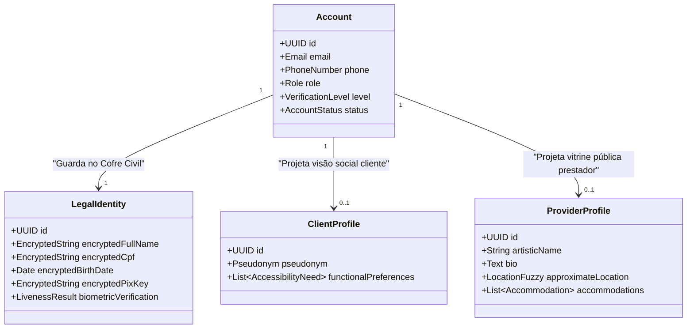

# 00.05B — GLOSSÁRIO DE DOMÍNIO E LINGUAGEM UBÍQUA (DDD)

> **Documento:** 00.05B  
> **Fase:** Requisitos e Concepção (Modelo em Cascata)  
> **Classificação:** Domain-Driven Design / Linguagem Ubíqua  
> **Versão:** 2.0.0  
> **Status:** Aprovado  

---

## 1. Princípio da Linguagem Ubíqua

No ecossistema **Enlace**, termos ambíguos são terminantemente eliminados do vocabulário de engenharia, código, documentação e contratos de API. Toda a equipe técnica e de negócio compartilha os mesmos conceitos formais:

```text
┌─────────────────────────────────────────────────────────────────────────────┐
│                          DICIONÁRIO DE DOMÍNIO FORMAL                       │
├─────────────────────────────────────────────────────────────────────────────┤
│  1. Account (Conta)                                                         │
│     Entidade base de autenticação, credenciais, MFA e identificador global. │
│     Uma Account NÃO é um perfil público e não carrega dados sociais.       │
│                                                                             │
│  2. Identity (Identidade Civil / KYC)                                       │
│     Entidade de comprovação legal de existência civil e maioridade (+18),   │
│     contendo documentos (RG/CNH), vetores biométricos e titularidade Pix.   │
│     Armazenada com exclusividade no Cofre Civil Criptografado.              │
│                                                                             │
│  3. Profile (Perfil Social / Artístico)                                     │
│     Entidade de representação social. Divide-se em:                         │
│     • ProviderProfile: Nome artístico, biografia, mídias públicas, tarifas; │
│     • ClientProfile: Pseudônimo automático compulsório e preferências.      │
│     A regra de ouro: Nome Civil NUNCA é igual a Nome Público.               │
│                                                                             │
│  4. Entitlement (Direito de Acesso a Conteúdo)                              │
│     Autorização formal, imutável e verificável conferida a um usuário para  │
│     consumir um determinado item de mídia privada ou canal VIP.             │
│                                                                             │
│  5. Accessibility Accommodation (Acomodação de Acessibilidade)              │
│     Atributo concreto de capacitação humana (ex: Libras) ou infraestrutura  │
│     física (ex: rampa, elevador) ofertado pelo prestador ou demandado pelo  │
│     cliente para viabilizar um atendimento inclusivo.                       │
│                                                                             │
│  6. Match Score de Acessibilidade                                           │
│     Índice numérico percentual (0 a 100%) calculado pelo motor vetorial que │
│     expressa o grau de compatibilidade entre as necessidades e as ofertas.  │
│                                                                             │
│  7. Request Card (Cartão de Intenção de Atendimento)                        │
│     Payload estruturado de dados (data, turno, duração, adaptações) gerado  │
│     pelo cliente para envio direto ao prestador via canal externo neutro.   │
│                                                                             │
│  8. Double-Blind Review Window (Janela de Avaliação Cega)                   │
│     Mecanismo temporal de 7 dias onde avaliações públicas mútuas só são    │
│     reveladas após ambas as partes emitirem seus pareceres.                 │
│                                                                             │
│  9. Confidential Safety Alert (Alerta Confidencial de Segurança)            │
│     Sinalização privada de risco ou conduta abusiva, invisível ao público,  │
│     que alimenta exclusivamente o motor Bayesiano de mitigação preventiva. │
│                                                                             │
│  10. Split Ledger (Livro-Razão de Repasse Financeiro)                       │
│      Registro transacional contábil de rateio (85% prestador / 15% taxa)    │
│      executado com liquidação instantânea no gateway via Pix.               │
└─────────────────────────────────────────────────────────────────────────────┘
```

---

## 2. Separação Canônica: Account vs. Identity vs. Profile


