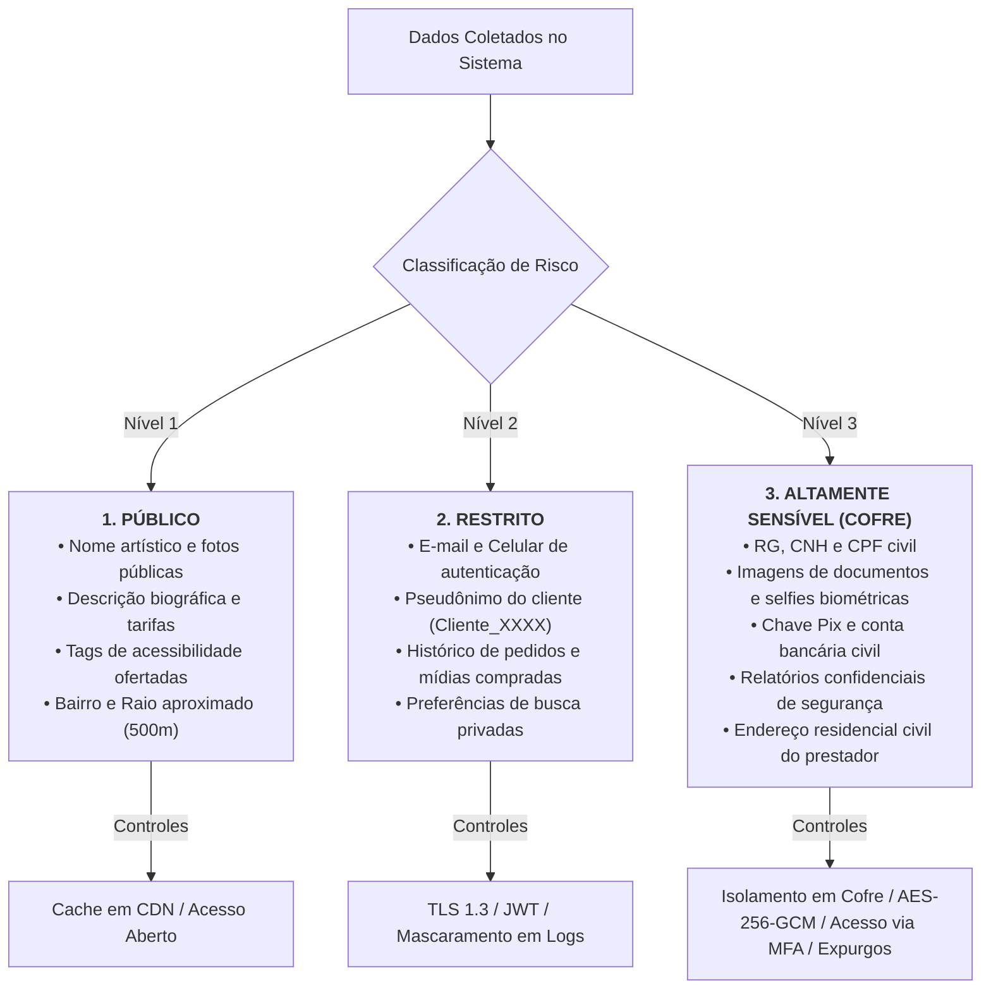

# 00.14B — CLASSIFICAÇÃO, GOVERNANÇA E MINIMIZAÇÃO DE DADOS

> **Documento:** 00.14B  
> **Fase:** Requisitos e Concepção (Modelo em Cascata)  
> **Classificação:** Engenharia de Dados / Segurança e Governança  
> **Versão:** 2.0.0  
> **Status:** Aprovado  

---

## 1. O Princípio Arquitetural: Data Minimization by Design

No ecossistema **Enlace**, a governança de dados rege-se por um axioma inegociável:

> **"Se a plataforma não possui uma necessidade técnica ou legal estrita para armazenar determinado dado: NÃO GUARDAMOS. Se precisamos guardar: deve ser criptografado, com controle de acesso rigoroso, trilha de auditoria e política de expurgo automático."**

```text
┌─────────────────────────────────────────────────────────────────────────────┐
│                       CICLO DE GOVERNANÇA DE DADOS                          │
├─────────────────────────────────────────────────────────────────────────────┤
│   CLASSIFICAÇÃO      CONTROLE DE ACESSO         TRILHA DE AUDITORIA         │
│   (Público,       ──>   (RBAC + ABAC     ──>   (Append-only imutável        │
│    Restrito ou         por Token Cripto)       com hash encadeado)          │
│    Altamente                                            │                   │
│    Sensível)                                            ▼                   │
│                                              RETENÇÃO & EXPURGO             │
│                                              (Deleção física em 15 dias     │
│                                               ou prazo legal de 6 meses)    │
└─────────────────────────────────────────────────────────────────────────────┘
```

---

## 2. Taxonomia de Classificação de Dados



---

## 3. Matriz de Retenção e Políticas de Expurgo

| Tipo de Dado | Classificação | Local de Armazenamento | Prazo Máximo de Retenção | Destino Final ao Término |
| :--- | :--- | :--- | :--- | :--- |
| **Fotos e Teasers Públicos** | Público | Storage de Objetos (Público) | Enquanto o perfil estiver ativo | Expurgo físico imediato na exclusão da conta. |
| **Documentos Civis (RG/CNH)** | Altamente Sensível | Cofre Criptografado (Vault) | Duração da conta ativa | Expurgo irreversível em até 15 dias após encerramento. |
| **Vetores Biométricos Faciais** | Altamente Sensível | Cofre Criptografado (Vault) | 90 dias após aprovação | Anonimização/Destruição; preserva apenas hash de verificação. |
| **Logs de Conexão e IP** | Restrito | Cluster de Logs Criptografado | 6 meses (Art. 15 Marco Civil) | Expurgo automático programado via TTL. |
| **Razão de Transações Pix** | Restrito | Banco de Dados Financeiro | 5 anos (Código Tributário) | Arquivamento fiscal em cofre frio (Cold Storage). |
| **Metadados EXIF de Fotos** | Descartável | Memória de Upload | **Zero segundos** (Eliminado no upload) | **Stripping imediato** antes de gravar em disco. |
