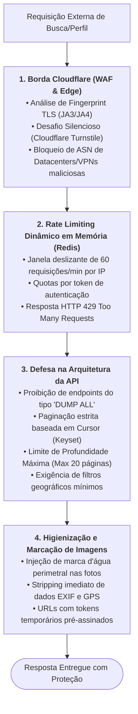

# 00.19 — ARQUITETURA ANTI-SCRAPING E PROTEÇÃO DE BORDA

> **Documento:** 00.19  
> **Fase:** Requisitos e Concepção (Modelo em Cascata)  
> **Classificação:** Engenharia de Segurança / Proteção de Catálogo  
> **Versão:** 2.0.0  
> **Status:** Aprovado  

---

## 1. O Desafio do Scraping Massivo no Segmento Adulto

Plataformas de anúncios adultos são alvos contínuos de bots maliciosos que visam clonar perfis, roubar acervos de fotos para estelionato e criar diretórios ilegais de doxxing. A **Plataforma Enlace** implementa uma arquitetura multicamadas para inviabilizar a raspagem automatizada em larga escala:

---

## 2. Medidas Técnicas Anti-Scraping Específicas

1. **Inexistência de Endpoints de Varredura Completa:**
   - A API não possui rotas que respondam a chamadas como `GET /api/v1/providers` sem parâmetros. Toda requisição exige obrigatoriamente a especificação de `state_uf` e `city`.
2. **Paginação por Cursor com Profundidade Bloqueada:**
   - Em vez do clássico `OFFSET`, que permite a bots iterar indefinidamente por números de páginas, o catálogo utiliza cursores opacos (`next_cursor = base64(timestamp + id)`).
   - O sistema bloqueia requisições que tentem ultrapassar mais de 20 páginas consecutivas na mesma busca, exigindo que o usuário refine seus filtros por bairro ou modalidade.
3. **Decoy / Honeytokens:**
   - Inserção silenciosa de elementos ocultos no HTML acessíveis apenas por robôs que ignoram seletores CSS. O acesso a essas armadilhas resulta em banimento preventivo do IP do scraper no WAF por 24 horas.
4. **Isolamento de Contatos:**
   - Telefones e canais externos não constam em texto puro no HTML inicial do catálogo de busca; sua visualização exige interação humana deliberada e token de sessão ativo.
