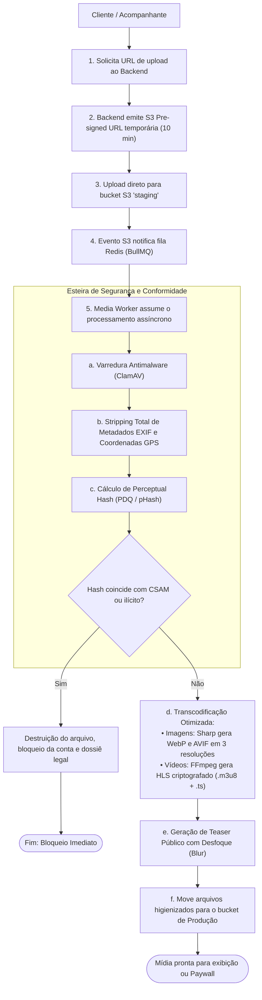

# 00.20 — PIPELINE DE INGESTÃO DE MÍDIA, STRIPPING DE METADADOS E ESTEGANOGRAFIA

> **Documento:** 00.20  
> **Fase:** Requisitos e Concepção (Modelo em Cascata)  
> **Classificação:** Engenharia de Mídia / Segurança Audiovisual  
> **Versão:** 2.0.0  
> **Status:** Aprovado  

---

## 1. Arquitetura do Pipeline Assíncrono de Mídia

A manipulação de arquivos de alta resolução nunca ocorre de forma síncrona nos servidores da API, evitando exaustão de memória e thread locks. O fluxo adota upload direto via URL pré-assinada e orquestração assíncrona por workers dedicados:



---

## 2. Stripping Obrigatório de Metadados EXIF e Privacidade Física

Muitas fotos tiradas por smartphones gravam nativamente coordenadas de latitude e longitude exatas, modelo do aparelho e data/hora do disparo.

- **Ação Técnica do Worker:**
  - O pipeline remove incondicionalmente todos os blocos de metadados (`EXIF`, `IPTC`, `XMP` e `MakerNotes`) antes de qualquer arquivo ser persistido no armazenamento de produção.
  - Isso garante que, mesmo na improvável hipótese de download de uma foto pública por terceiros, seja tecnicamente impossível extrair o endereço onde a foto foi registrada.

---

## 3. Injeção Dinâmica de Esteganografia no Desbloqueio

No momento da liquidação de uma mídia paga, o worker entra novamente em ação para gerar o pacote exclusivo do comprador:

```text
Entrada: Mídia Criptografada + ID do Comprador (Cliente_XXXX) + Hash da Ordem Pix
    │
    ▼
Processamento do Worker:
 ├── Aplicação de Marca d'Água Visível translúcida (20% opacidade)
 └── Injeção Esteganográfica LSB nos canais de crominância (Invisível)
    │
    ▼
Saída: Mídia assinada entregue via playlist HLS com chave efêmera de 15 minutos
```
