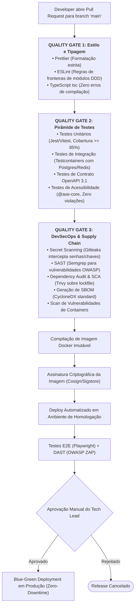

# 00.22 — CI/CD, DEVSECOPS E SEGURANÇA NA CADEIA DE SUPRIMENTOS (SUPPLY CHAIN)

> **Documento:** 00.22  
> **Fase:** Requisitos e Concepção (Modelo em Cascata)  
> **Classificação:** Engenharia de Release / DevSecOps  
> **Versão:** 2.0.0  
> **Status:** Aprovado  

---

## 1. O Pipeline Unificado de Integração e Entrega Contínua

Nenhum artefato é promovido para homologação ou produção sem aprovação determinística em todos os **Quality Gates** automatizados do pipeline:



---

## 2. Padrão de Ramificação (Branching Strategy)

Para evitar os gargalos complexos do Git Flow tradicional, o Enlace adota um modelo baseado em **Trunk-Based simplificado**:

```text
main (Protegida contra push direto / Merge apenas via PR com aprovação de 2 revisores)
  ▲
  ├── feature/ENL-102-accessibility-match-engine
  ├── fix/ENL-205-pix-idempotency-timeout
  └── security/ENL-301-upgrade-jwt-library
```

---

## 3. Segurança na Cadeia de Suprimentos (Software Supply Chain Security)

1. **Lockfiles Rígidos e Determinísticos:**
   - Uso de `package-lock.json` ou `pnpm-lock.yaml` estritamente comutados, com verificação de integridade de hash SHA-512 de cada pacote de terceiros.
2. **Software Bill of Materials (SBOM):**
   - A cada build de produção, o pipeline gera um arquivo de inventário de dependências estruturado em conformidade com o padrão `CycloneDX`, viabilizando rastreamento instantâneo de vulnerabilidades emergentes (*zero-days*).
3. **Imagens de Container Mínimas e Imutáveis:**
   - Uso de imagens base `distroless` ou `alpine` minimalistas, sem compiladores, shells interativas ou ferramentas de rede no ambiente de produção final.
4. **Assinatura Digital de Artefatos:**
   - As imagens Docker enviadas ao Container Registry são assinadas digitalmente com o `Cosign`, impedindo que containers adulterados sejam executados no cluster Kubernetes.
