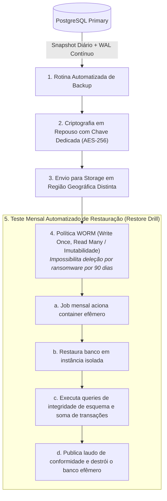

# 00.23 — BACKUP, RESILIÊNCIA E DISASTER RECOVERY (DR)

> **Documento:** 00.23  
> **Fase:** Requisitos e Concepção (Modelo em Cascata)  
> **Classificação:** Engenharia de Confiabilidade / Continuidade de Negócios  
> **Versão:** 2.0.0  
> **Status:** Aprovado  

---

## 1. Princípio Fundamental de Continuidade

No projeto **Enlace**, a engenharia rejeita premissas não verificadas:

> **"Um backup que nunca foi restaurado e validado em ambiente isolado é apenas uma hipótese, não uma garantia de recuperação."**

---

## 2. Objetivos de Recuperação de Desastre (SLOs de DR)

| Métrica | Parâmetro Alvo | Mecanismo Técnico de Garantia |
| :--- | :---: | :--- |
| **Recovery Point Objective (RPO)** | $\le 5\text{ minutos}$ | Streaming contínuo de logs de transação (*Write-Ahead Logging - WAL*) do PostgreSQL para bucket geograficamente distribuído. |
| **Recovery Time Objective (RTO)** | $\le 60\text{ minutos}$ | Automação completa de subida de infraestrutura via IaC (Terraform) e scripts de restauração idempotentes. |

---

## 3. O Ciclo de Vida do Backup Imutável

---

## 4. Política de Retenção de Cópias de Segurança (Regra GFS)

O sistema adota a estratégia clássica **Grandfather-Father-Son (GFS)**:

1. **Backups Diários (Son):** Preservados por 30 dias corridos.
2. **Backups Semanais (Father):** Preservados por 12 semanas.
3. **Backups Mensais (Grandfather):** Preservados por 5 anos (atendendo à legislação fiscal e contábil brasileira).

---

## 5. Playbook de Contingência e Chaveamento (Failover)

Na hipótese de pane severa na região primária da nuvem:
1. O DNS de borda na Cloudflare detecta a perda de heartbeat da região primária após 60 segundos;
2. O script de contingência automatizado promove a réplica de leitura para primária na região de failover;
3. As variáveis de conexão do monólito modular são atualizadas via secrets gerenciados;
4. O tráfego de usuários é direcionado para a infraestrutura espelho com perda máxima de dados limitada a 5 minutos (RPO).
