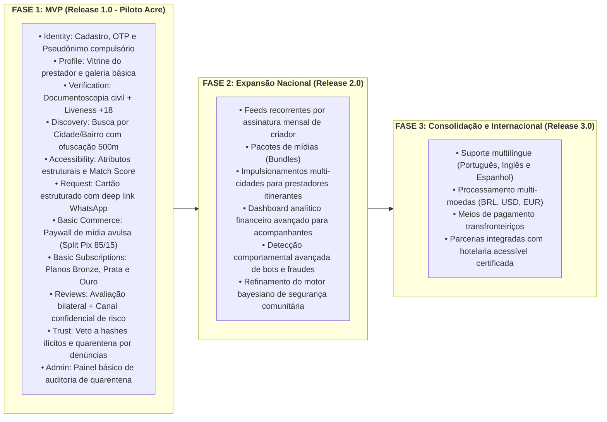

# 00.25 — CONTROLE ESTRITO DE ESCOPO: MVP BRUTALMENTE FOCADO VS. V2 VS. V3

> **Documento:** 00.25  
> **Fase:** Requisitos e Concepção (Modelo em Cascata)  
> **Classificação:** Gestão de Produto / Release Planning  
> **Versão:** 2.0.0  
> **Status:** Aprovado  

---

## 1. Princípio de Engenharia: Redução Radical de Fricção no Lançamento

Para evitar atrasos catastróficos e garantir uma entrega impecável, o escopo da **Plataforma Enlace** é dividido em três horizontes evolutivos estritos:

```text
PRODUTO COMPLETO (VISÃO FUTURA)
██████████████████████████████████████████████████████████████

MVP FOCADO (PILOTO ACRE - RELEASE 1.0)
████████████████████
```

---

## 2. Matriz de Entregáveis por Release



---

## 3. Delimitação Estrita do MVP (O que NÃO entra na Versão 1.0)

Para manter a disciplina do escopo do MVP:
1. **Sem Assinaturas de Feeds VIP no dia 1:** Apenas vendas de mídias avulsas desbloqueáveis por Pix unitário, simplificando radicalmente o checkout inicial.
2. **Sem Chat Interno:** Contato 100% externo via WhatsApp/Telegram a partir do cartão de intenção.
3. **Sem Pagamento de Encontros Presenciais:** A plataforma não cobra nem intermedeia o valor do atendimento físico.
4. **Sem Bots de Pânico:** O sistema foca em verificação de identidade civil e mitigação preventiva por score de risco.
