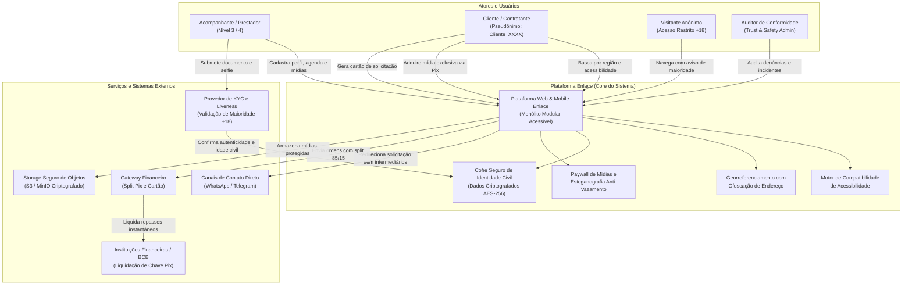

# 01.01 — DIAGRAMA DE CONTEXTO GERAL DO SISTEMA

> **Documento:** 01.01  
> **Fase:** Modelagem e Arquitetura (Modelo em Cascata)  
> **Classificação:** Arquitetura de Software / Visão Sistêmica  
> **Versão:** 1.0.0  
> **Status:** Aprovado  

---

## 1. Visão Geral do Ecossistema Enlace

O diagrama a seguir descreve a fronteira operacional do **Sistema Enlace**, ilustrando como os diferentes tipos de usuários e sistemas externos interagem com a plataforma sem gerar burocracia ou riscos desnecessários à privacidade:

---

## 2. Racional de Engenharia das Fronteiras

1. **Desacoplamento do Encontro Presencial:**
   - A linha que conecta o usuário aos `Canais de Contato Direto` evidencia que a plataforma não intermedeia a conversa privada nem taxa o encontro físico, preservando a soberania do prestador e a discrição do cliente.
2. **Separação Rígida do Cofre Civil:**
   - O `Cofre Seguro de Identidade Civil` comunica-se apenas com os processos de verificação documental e repasses financeiros, sem qualquer interface com o catálogo público.
3. **Autonomia do Motor de Acessibilidade:**
   - O `Motor de Compatibilidade de Acessibilidade` avalia continuamente atributos de inclusão (Libras, mobilidade, sensorial) para garantir que a busca priorize conexões adequadas às necessidades funcionais.
