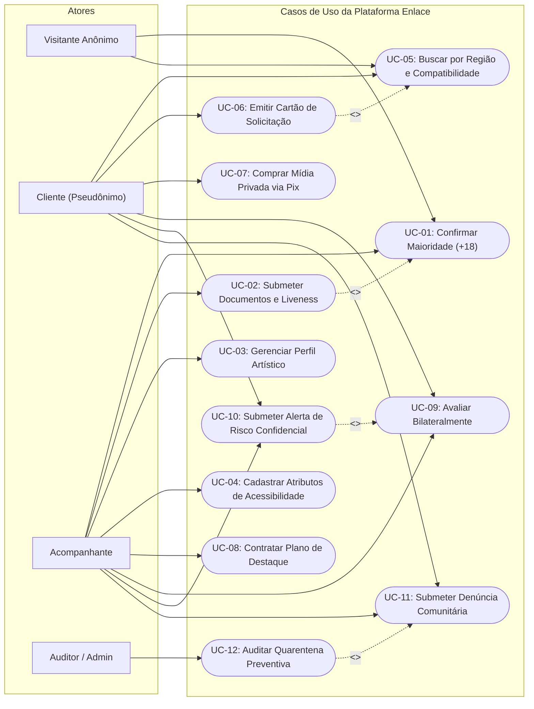

# 01.02 — DIAGRAMAS DE CASOS DE USO (UML USE CASES)

> **Documento:** 01.02  
> **Fase:** Modelagem e Arquitetura (Modelo em Cascata)  
> **Classificação:** Modelagem Funcional / UML  
> **Versão:** 1.0.0  
> **Status:** Aprovado  

---

## 1. Diagrama de Casos de Uso Geral

---

## 2. Relações Estruturais dos Casos de Uso

1. **`<<include>>` de Maioridade em KYC:**
   - O cadastro e envio de documentos (`UC-02`) inclui compulsoriamente a validação estrita de maioridade civil (`UC-01`).
2. **`<<extend>>` de Solicitação a partir da Busca:**
   - A emissão do cartão de solicitação e redirecionamento direto (`UC-06`) estende o fluxo de busca e descoberta de perfis compatíveis (`UC-05`).
3. **`<<include>>` de Alerta Confidencial de Segurança:**
   - Ao emitir uma avaliação bilateral (`UC-09`), o usuário tem a opção de incluir um relato confidencial de risco (`UC-10`), processado exclusivamente pelo motor de reputação sem exibição pública.
