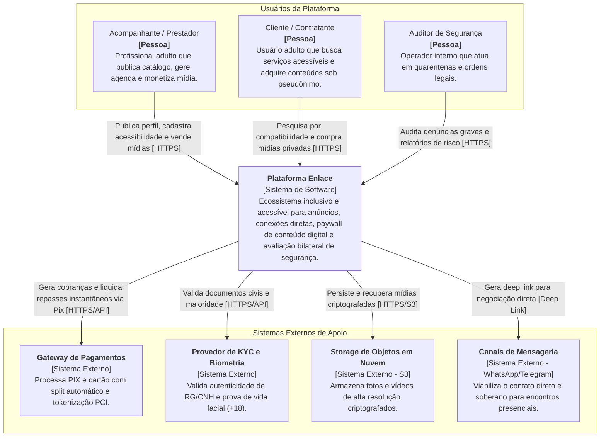

# 01.03 — ARQUITETURA C4 — NÍVEL 1: CONTEXTO DO SISTEMA

> **Documento:** 01.03  
> **Fase:** Modelagem e Arquitetura (Modelo em Cascata)  
> **Classificação:** Arquitetura C4 / Nível 1  
> **Versão:** 1.0.0  
> **Status:** Aprovado  

---

## 1. Diagrama C4 — Nível 1: Contexto

O diagrama de contexto C4 posiciona a **Plataforma Enlace** no centro das interações de usuários e integrações com o ecossistema externo:

---

## 2. Decisões Arquiteturais de Contexto

1. **Separação de Responsabilidade de Pagamentos:**
   - A plataforma não armazena dados de cartão nem executa liquidação bancária própria; a responsabilidade de compliance financeiro e split é delegada a um gateway de alta disponibilidade regulado pelo Banco Central do Brasil.
2. **Isolamento de Identidade Civil:**
   - A comprovação de maioridade e identidade legal é intermediada por um provedor especializado de KYC com validação biométrica facial em tempo de cadastro.
3. **Descentralização do Encontro Físico:**
   - O contato entre cliente e acompanhante é direcionado para canais externos neutros, evitando monitoramento invasivo e preservando a intimidade das partes.
