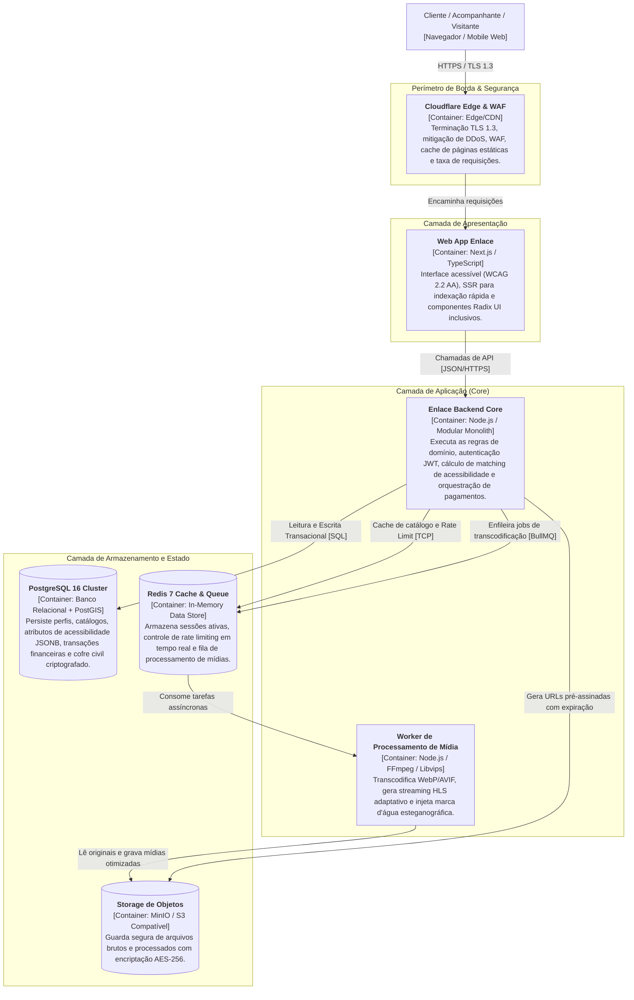

# 01.04 — ARQUITETURA C4 — NÍVEL 2: CONTAINERS DA APLICAÇÃO

> **Documento:** 01.04  
> **Fase:** Modelagem e Arquitetura (Modelo em Cascata)  
> **Classificação:** Arquitetura C4 / Nível 2  
> **Versão:** 1.0.0  
> **Status:** Aprovado  

---

## 1. Diagrama C4 — Nível 2: Containers

O diagrama de containers apresenta os componentes de tempo de execução, bancos de dados e serviços auxiliares que formam a infraestrutura da **Plataforma Enlace**:

---

## 2. Racional das Decisões de Containers

1. **Next.js com Server-Side Rendering (SSR):**
   - Viabiliza renderização ultrarrápida do catálogo público, fundamental para conexões móveis variáveis no Acre e em outras regiões do Brasil, assegurando conformidade estrita de acessibilidade no HTML inicial.
2. **Worker Especializado de Mídia Desacoplado via Redis:**
   - O processamento pesado de vídeos (conversão para HLS e injeção de esteganografia frame a frame) não bloqueia as threads do servidor de APIs, operando de forma assíncrona por meio de filas gerenciadas no Redis.
3. **PostgreSQL com Esquema de Cofre Dedicado:**
   - Um único cluster relacional consolidado reduz drasticamente os custos operacionais e a complexidade de manutenção, mantendo a segregação de segurança através de esquemas isolados (`public` vs `vault_civil`) e regras de Row-Level Security (RLS).
