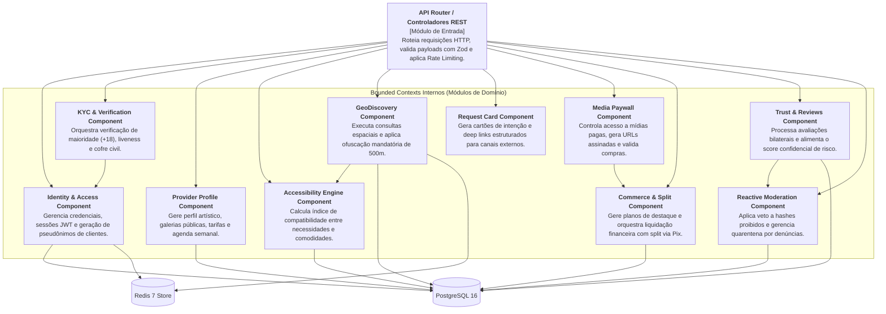

# 01.05 — ARQUITETURA C4 — NÍVEL 3: COMPONENTES DO CORE DA APLICAÇÃO

> **Documento:** 01.05  
> **Fase:** Modelagem e Arquitetura (Modelo em Cascata)  
> **Classificação:** Arquitetura C4 / Nível 3  
> **Versão:** 1.0.0  
> **Status:** Aprovado  

---

## 1. Diagrama C4 — Nível 3: Componentes do Monólito Modular

O diagrama a seguir detalha a organização interna dos módulos (*Bounded Contexts*) que operam dentro do container **Enlace Backend Core**:

---

## 2. Comunicação Inter-Componentes

1. **Invocação Direta via Interfaces Fortemente Tipadas:**
   - Como os módulos residem dentro do mesmo monólito, as chamadas síncronas entre domínios ocorrem em memória por interfaces injetadas via injeção de dependência (`Dependency Injection`), eliminando serialização HTTP redundante.
2. **Eventos de Domínio Internos (In-Memory Event Bus):**
   - Eventos como `PaymentConfirmedEvent` ou `ProfileSuspendedEvent` são propagados através de um *Event Bus* assíncrono interno, desacoplando o módulo financeiro do paywall de mídia e das notificações.
