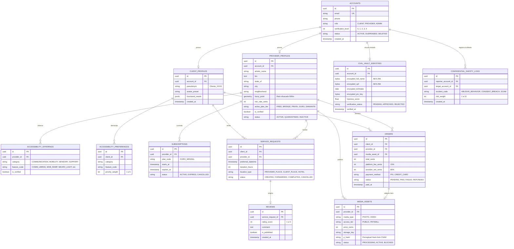

# 01.06 — MODELO DE ENTIDADE E RELACIONAMENTO (ERD)

> **Documento:** 01.06  
> **Fase:** Modelagem e Arquitetura (Modelo em Cascata)  
> **Classificação:** Engenharia de Dados / Modelagem Relacional  
> **Versão:** 1.0.0  
> **Status:** Aprovado  

---

## 1. Diagrama de Entidade e Relacionamento (ERD)

O diagrama a seguir representa as principais entidades do banco de dados relacional (PostgreSQL), evidenciando a separação estrita entre perfis sociais, motor de acessibilidade, transações financeiras e o cofre de dados civis:

---

## 2. Destaques da Modelagem de Dados

1. **Separação Criptográfica do Cofre (`CIVIL_VAULT_IDENTITIES`):**
   - Os dados civis não estão em colunas de texto claro na tabela `ACCOUNTS`. Eles são armazenados em esquema segregado com colunas tipadas como `bytea` sob criptografia de chave gerenciada (AES-256).
2. **Normalização dos Atributos de Acessibilidade:**
   - As tabelas `ACCESSIBILITY_OFFERINGS` e `ACCESSIBILITY_PREFERENCES` permitem que o motor de compatibilidade execute junções rápidas via índices relacionais e operadores de conjuntos.
3. **Geometria Difusa (`fuzzy_point`):**
   - A coluna de geolocalização utiliza o tipo `geometry` do PostGIS, alimentada com uma dispersão estocástica deliberada para garantir que as coordenadas reais jamais fiquem expostas.
