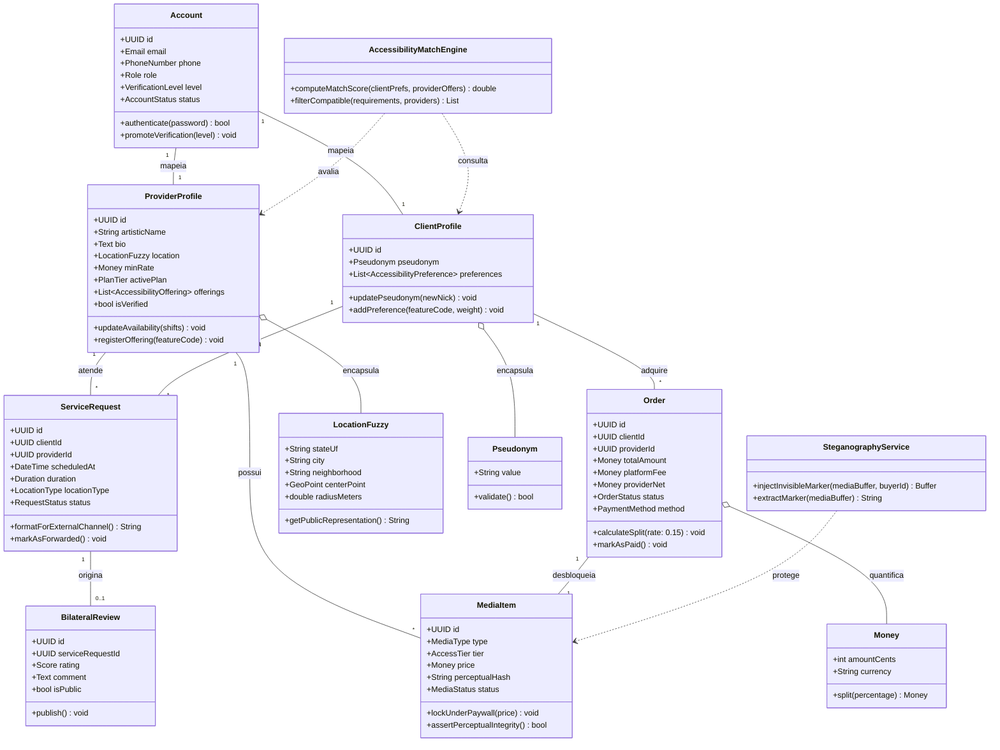

# 01.07 — DIAGRAMA DE CLASSES DE DOMÍNIO (DDD)

> **Documento:** 01.07  
> **Fase:** Modelagem e Arquitetura (Modelo em Cascata)  
> **Classificação:** Engenharia de Software / Domain-Driven Design (DDD)  
> **Versão:** 1.0.0  
> **Status:** Aprovado  

---

## 1. Diagrama de Classes de Domínio

O diagrama a seguir modela as entidades, objetos de valor (*Value Objects*) e serviços de domínio no padrão Domain-Driven Design:

---

## 2. Invariantes de Domínio e Encapsulamento

1. **Invariante do Pseudônimo:**
   - A classe `ClientProfile` só aceita instâncias válidas de `Pseudonym` que respeitem a máscara de privacidade, impedindo a injeção acidental de nomes civis ou dados de contato.
2. **Invariante de Split Financeiro (`Order`):**
   - O cálculo do rateio financeiro (`calculateSplit`) garante invariância monetária exata: $\text{totalAmount} = \text{platformFee} + \text{providerNet}$, prevenindo discrepâncias por arredondamento de centavos.
3. **Ofuscação como Objeto de Valor (`LocationFuzzy`):**
   - A localização geográfica do prestador é um objeto imutável que rejeita coordenadas com raio de dispersão menor que 500 metros, garantindo a proteção física por desenho no próprio domínio.
