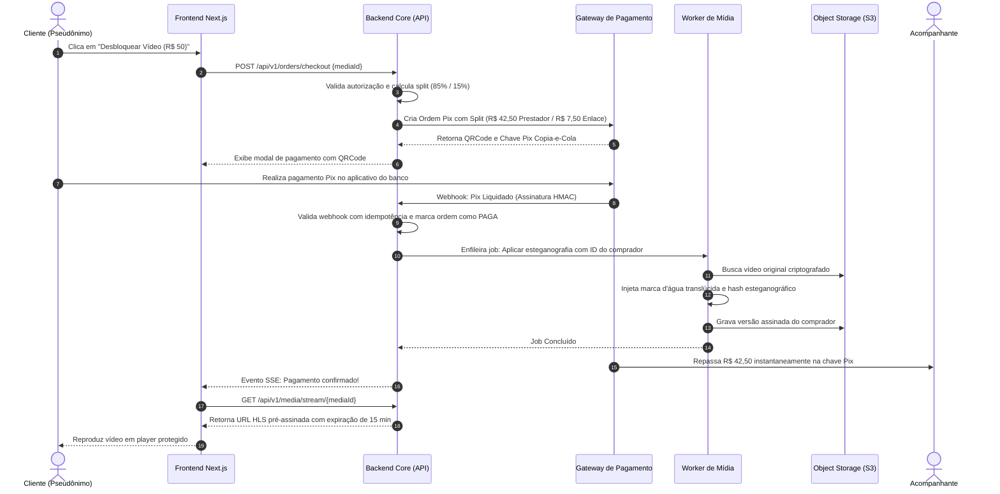
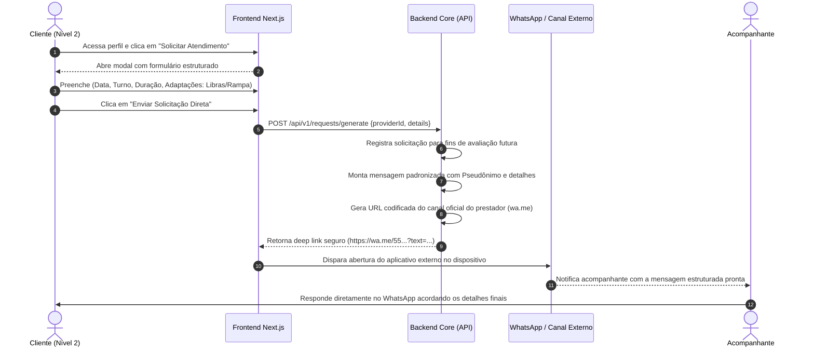

# 01.08 — DIAGRAMAS DE SEQUÊNCIA OPERACIONAIS

> **Documento:** 01.08  
> **Fase:** Modelagem e Arquitetura (Modelo em Cascata)  
> **Classificação:** Engenharia de Software / Dinâmica de Sistemas  
> **Versão:** 1.0.0  
> **Status:** Aprovado  

---

## 1. Sequência 1: Compra de Mídia Privada via Pix com Split Instantâneo

O diagrama a seguir descreve a interação ponta a ponta na aquisição de fotos ou vídeos exclusivos sob paywall:

---

## 2. Sequência 2: Solicitação e Redirecionamento Direto para Canal Externo

O fluxo a seguir ilustra a baixa fricção e a ausência de burocracia na conexão para encontros presenciais:

