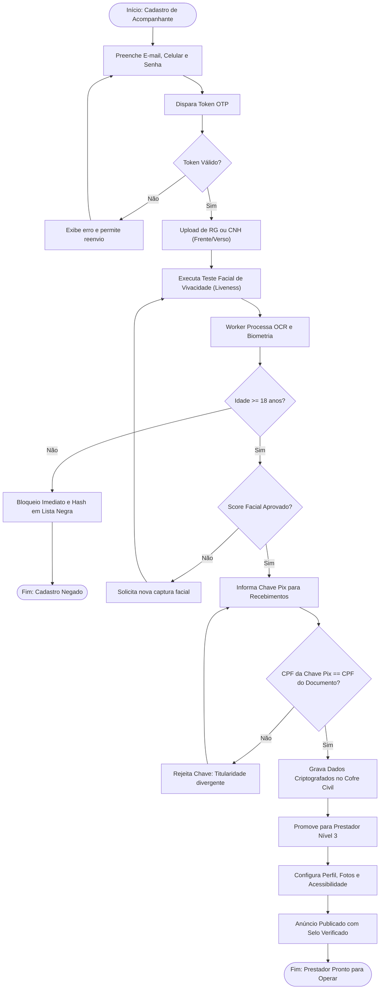
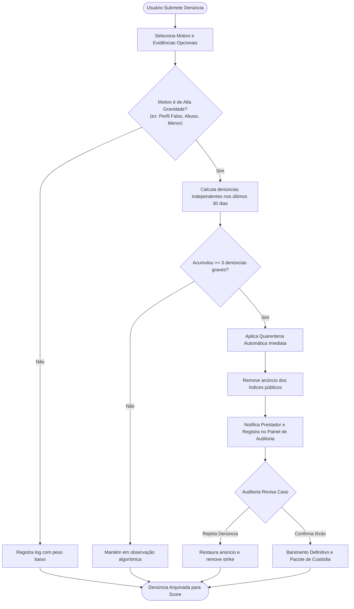

# 01.09 — DIAGRAMAS DE ATIVIDADES E WORKFLOWS DO PROCESSO

> **Documento:** 01.09  
> **Fase:** Modelagem e Arquitetura (Modelo em Cascata)  
> **Classificação:** Engenharia de Processos / UML Activity  
> **Versão:** 1.0.0  
> **Status:** Aprovado  

---

## 1. Workflow 1: Onboarding e Verificação Escalonada de Acompanhante

O fluxo a seguir mapeia a esteira de validação civil e financeira antes que qualquer anúncio possa ser publicado:

---

## 2. Workflow 2: Denúncia Comunitária Reativa e Quarentena Preventiva

O fluxo a seguir detalha o modelo sem dependência de moderação humana síncrona:

