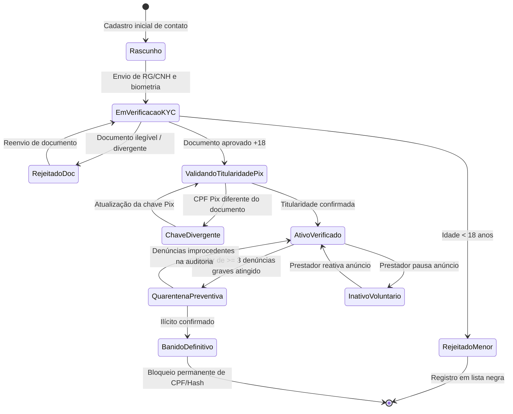
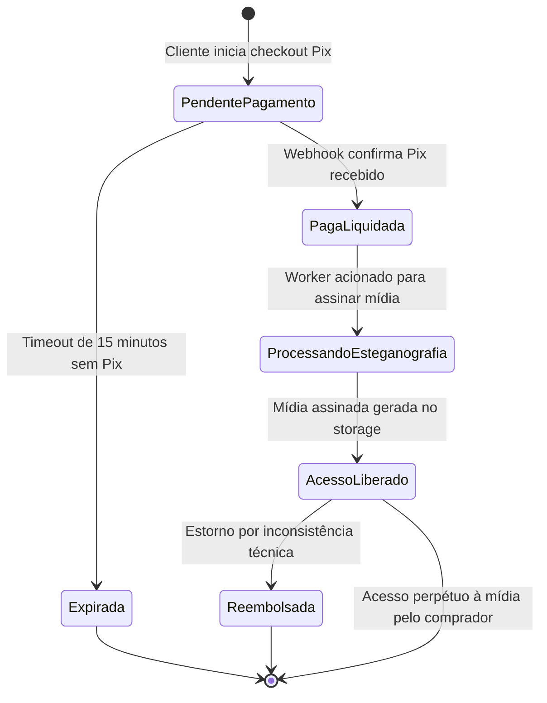
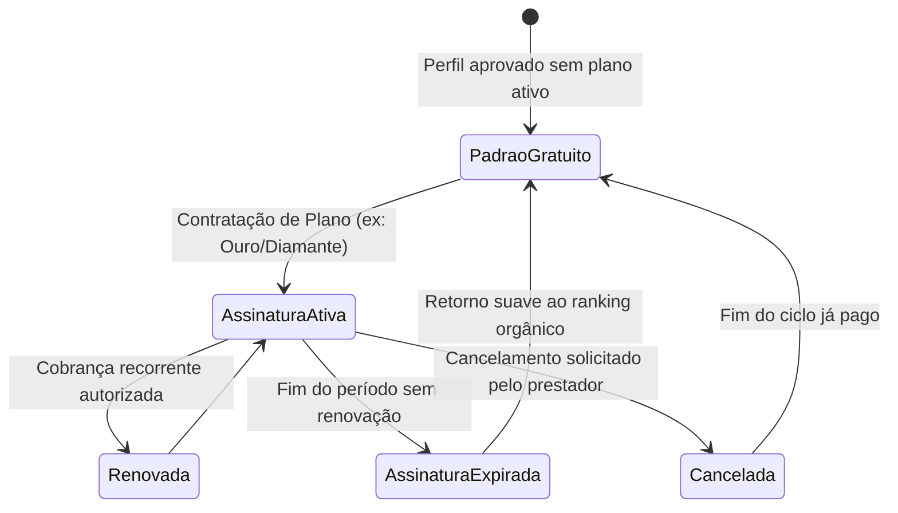

# 01.10 — MÁQUINAS DE ESTADOS FINITOS (FSM)

> **Documento:** 01.10  
> **Fase:** Modelagem e Arquitetura (Modelo em Cascata)  
> **Classificação:** Engenharia de Software / Autômatos Finitos  
> **Versão:** 1.0.0  
> **Status:** Aprovado  

---

## 1. FSM 1: Ciclo de Vida do Perfil de Acompanhante

---

## 2. FSM 2: Ciclo de Vida da Ordem de Pagamento e Paywall

---

## 3. FSM 3: Ciclo de Vida da Assinatura de Destaque do Prestador

