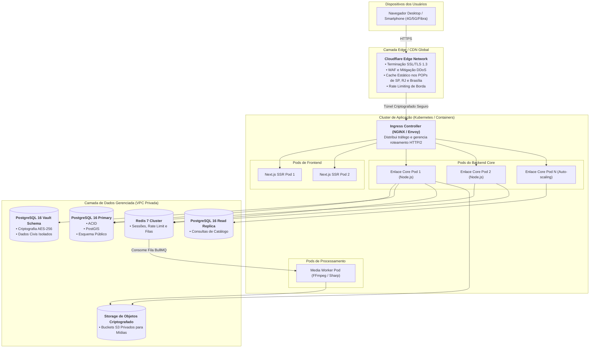

# 01.11 — ARQUITETURA DE IMPLANTAÇÃO (DEPLOYMENT / INFRAESTRUTURA)

> **Documento:** 01.11  
> **Fase:** Modelagem e Arquitetura (Modelo em Cascata)  
> **Classificação:** Engenharia de Infraestrutura / DevOps & Cloud  
> **Versão:** 1.0.0  
> **Status:** Aprovado  

---

## 1. Diagrama de Implantação Física / Cloud

O diagrama a seguir descreve a topologia de nós, containers e serviços gerenciados em nuvem para sustentar alta disponibilidade e resiliência:

---

## 2. Destaques de Segurança de Rede (VPC e Isolamento)

1. **VPC Privada Sem Acesso Público:**
   - O banco de dados PostgreSQL e as instâncias Redis não possuem IP público, sendo acessíveis exclusivamente a partir da rede privada interna dos pods da aplicação.
2. **Separação de Leitura e Escrita:**
   - As consultas intensivas de busca de acompanhantes e filtros por acessibilidade são direcionadas para a réplica de leitura (`Read Replica`), desonerando o nó primário para transações financeiras e cadastros.
3. **Escalonamento Automático (HPA):**
   - Os pods do Backend Core escalam horizontalmente com base no consumo de CPU e latência média das requisições via *Horizontal Pod Autoscaler* (HPA).
