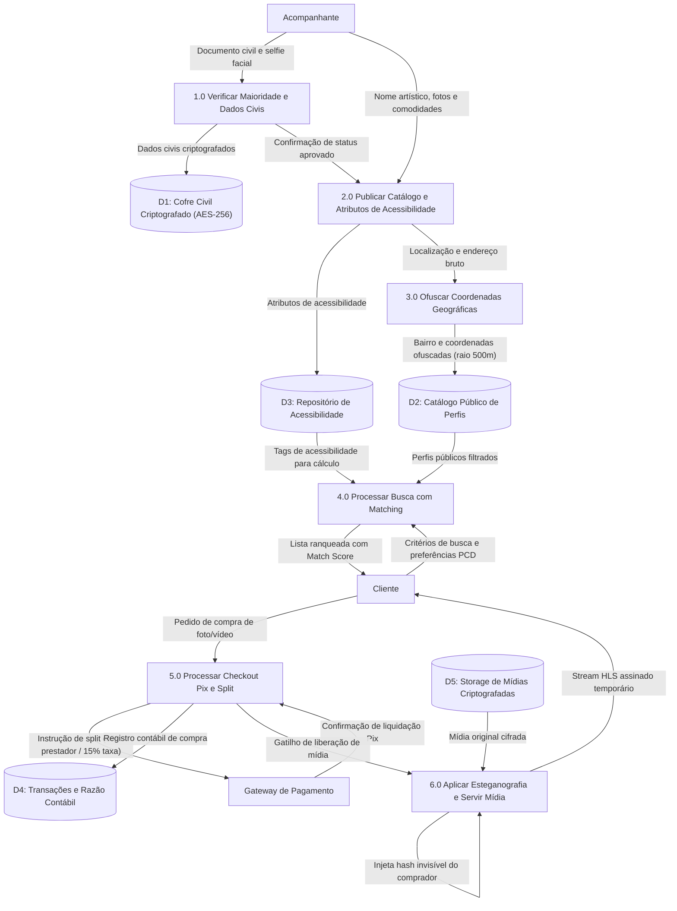

# 01.12 — DIAGRAMAS DE FLUXO DE DADOS (DFD)

> **Documento:** 01.12  
> **Fase:** Modelagem e Arquitetura (Modelo em Cascata)  
> **Classificação:** Engenharia de Dados / Análise Estruturada  
> **Versão:** 1.0.0  
> **Status:** Aprovado  

---

## 1. DFD Nível 1: Fluxo de Dados Transacionais e Proteção de Privacidade

O diagrama a seguir rastreia as transformações de dados, depósitos (*Data Stores*) e fronteiras de sanitização no tráfego da plataforma:

---

## 2. Garantias do Fluxo de Dados

1. **Barreira Anti-Vazamento de Dados Civis:**
   - Observa-se que nenhum fluxo de dados conecta o depósito `D1: Cofre Civil Criptografado` aos processos de busca (`P4`) ou catálogo (`P2`), impedindo a exposição involuntária de nomes civis ou CPFs.
2. **Transformação Irreversível de Coordenadas (`P3`):**
   - O processo de ofuscação (`3.0`) adiciona dispersão matemática ao geodado antes de persisti-lo no depósito público `D2`, garantindo que nem mesmo uma inspeção do banco de dados público revele a localização exata do prestador.
