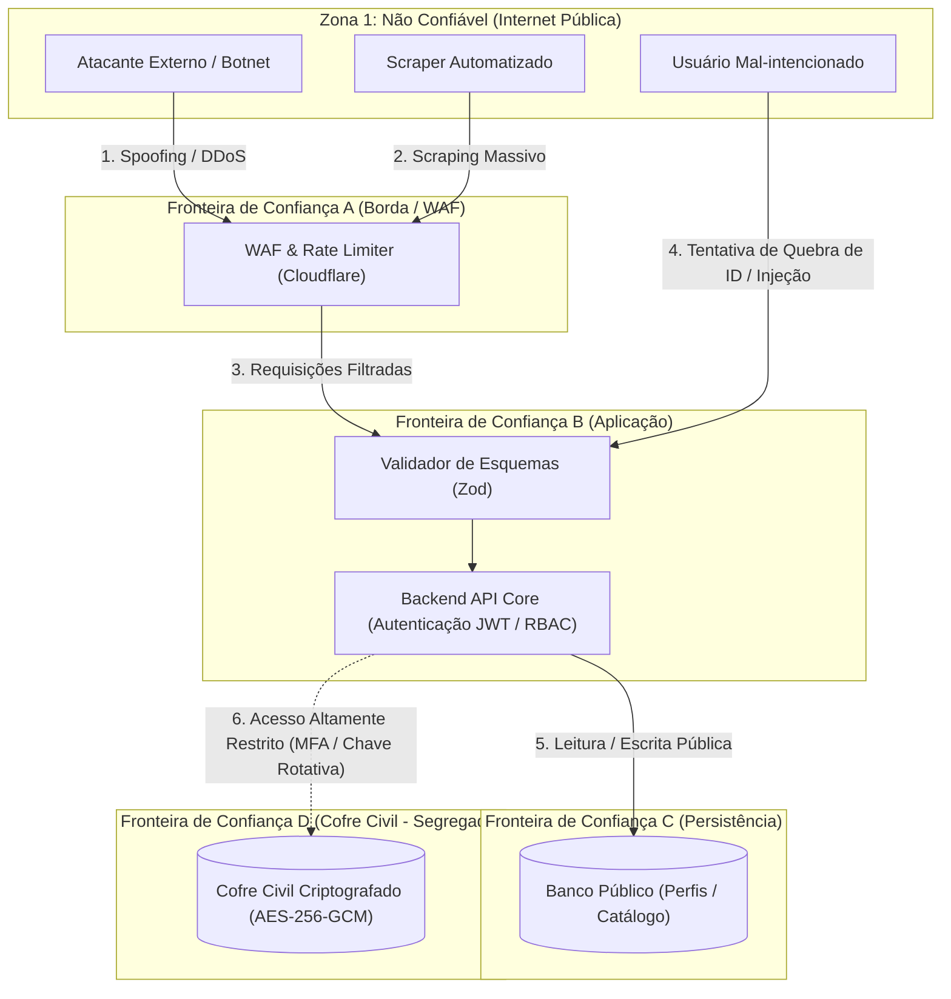

# 01.13 — MODELO DE AMEAÇAS E TRUST (STRIDE THREAT MODEL)

> **Documento:** 01.13  
> **Fase:** Modelagem e Arquitetura (Modelo em Cascata)  
> **Classificação:** Engenharia de Segurança / Modelagem de Ameaças  
> **Versão:** 1.0.0  
> **Status:** Aprovado  

---

## 1. Fronteiras de Confiança e Vetores de Ameaça

O diagrama a seguir identifica as quatro **Fronteiras de Confiança (Trust Boundaries)** onde residem os maiores riscos de exploração:

---

## 2. Análise Detalhada sob o Framework STRIDE

| Categoria STRIDE | Ameaça Específica Mapeada | Impacto no Negócio / Usuário | Contramedida de Engenharia Adotada |
| :--- | :--- | :--- | :--- |
| **Spoofing** (Falsificação de Identidade) | Criação de perfil com fotos roubadas de terceiros ou tentativa de cadastro de menor com documento adulterado. | Dano à reputação da vítima, fraude e ilícito legal gravíssimo. | Verificação biométrica facial com teste de vivacidade (*liveness*) e OCR cruzado no documento oficial com checagem de base governamental. |
| **Tampering** (Adulteração de Dados) | Modificação do percentual de split financeiro ou injeção de parâmetros na ordem Pix. | Prejuízo financeiro e desvio de verbas de acompanhantes. | Cálculos de split executados exclusivamente no backend; parâmetros do webhook assinados criptograficamente com HMAC-SHA256. |
| **Repudiation** (Repúdio) | Cliente contesta compra de mídia digital afirmando não ter autorizado a transação. | Chargeback e contestações bancárias injustas. | Registro imutável de logs de transação com carimbo de tempo, IP de conexão, chave Pix e hash do dispositivo do comprador. |
| **Information Disclosure** (Exposição de Informações) | Revelação de dados civis do prestador (nome real, CPF, residência) ou do cliente por falha de API. | Doxxing, perseguição física, quebra de anonimato e violação gravíssima da LGPD. | Segregação estrita no `Cofre Civil`, pseudônimo compulsório de clientes e ofuscação obrigatória de coordenadas GPS (raio 500m). |
| **Denial of Service** (Negação de Serviço) | Sobrecarga de requisições de busca ou automação de denúncias falsas para derrubar concorrentes. | Indisponibilidade da plataforma e prejuízo financeiro a prestadores legítimos. | Rate limiting adaptativo em Redis, desafios de prova de trabalho (Turnstile) e ponderação de reputação do denunciante no motor reativo. |
| **Elevation of Privilege** (Elevação de Privilégios) | Usuário cliente tenta acessar endpoints do painel de auditoria administrativa ou dados de cofre. | Acesso desautorizado a cadastros civis e dossiês de denúncias. | Autenticação baseada em claims JWT assinados, RBAC rígido com *least privilege* e auditoria contínua de acessos administrativos. |
