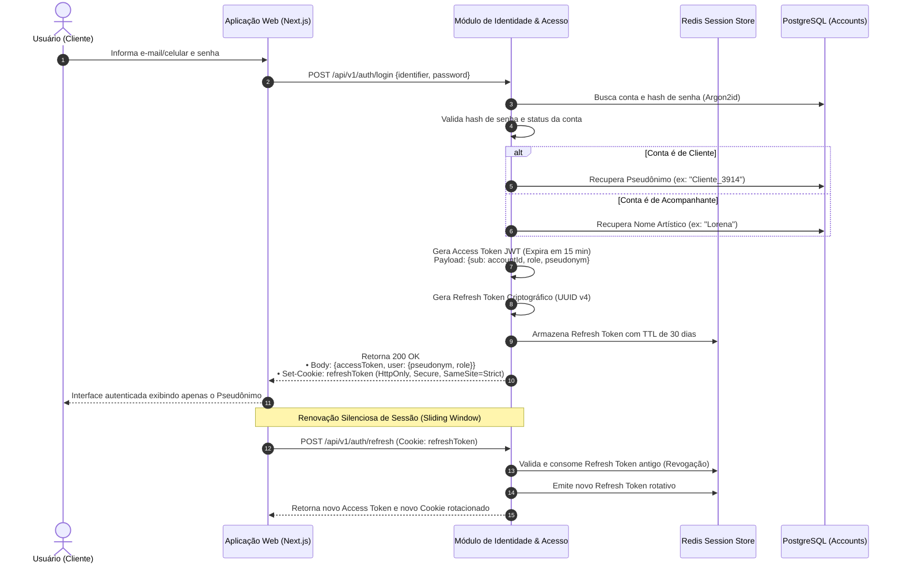

# 01.14 — FLUXOS DE AUTENTICAÇÃO, IDENTIDADE E PSEUDONIMIZAÇÃO

> **Documento:** 01.14  
> **Fase:** Modelagem e Arquitetura (Modelo em Cascata)  
> **Classificação:** Engenharia de Segurança / Protocolos de Autenticação  
> **Versão:** 1.0.0  
> **Status:** Aprovado  

---

## 1. Fluxo de Autenticação com Rotação de Tokens e Pseudônimo

O diagrama a seguir descreve o protocolo de emissão e renovação de credenciais, assegurando sessões protegidas sem exposição de dados pessoais:



---

## 2. Algoritmo de Geração de Pseudônimo Compulsório

Para garantir que o cliente nunca seja identificado por seus dados reais, o sistema executa a seguinte rotina determinística e opaca no momento do registro:

```text
Entrada: AccountID (UUID v4) + Pepper Secreto da Aplicação
    │
    ▼
Função de Dispersão: HMAC-SHA256(AccountID, SystemPepper)
    │
    ▼
Extração Numérica: InteiroDerivado = BytesExtraídos % 9000 + 1000
    │
    ▼
Pseudônimo Gerado: "Cliente_" + InteiroDerivado (ex: "Cliente_4829")
```

- **Propriedades do Algoritmo:**
  - **Irreversibilidade Pública:** É matematicamente impossível para outro usuário deduzir o e-mail ou nome civil do cliente a partir do pseudônimo `Cliente_4829`.
  - **Consistência de Apelido:** O cliente preserva a mesma identidade pública anônima em todas as suas avaliações e solicitações na plataforma.
