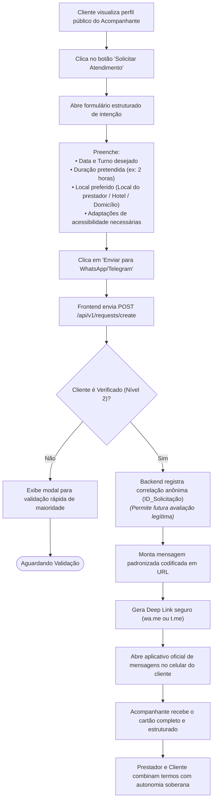

# 01.15 — FLUXO DE SOLICITAÇÃO E CONEXÃO EXTERNA DIRETA

> **Documento:** 01.15  
> **Fase:** Modelagem e Arquitetura (Modelo em Cascata)  
> **Classificação:** Engenharia de Produto / Integração sem Fricção  
> **Versão:** 1.0.0  
> **Status:** Aprovado  

---

## 1. Fluxo do Cartão de Solicitação Estruturado

O diagrama a seguir detalha como a plataforma viabiliza a negociação autônoma entre as partes através de deep links sem intermediários ou monitoramento invasivo:



---

## 2. Padrão Estruturado da Mensagem Formatada

Ao clicar no canal externo do acompanhante, a mensagem é pré-carregada no mensageiro com a seguinte formatação limpa e profissional:

```text
Olá [Nome Artístico], vi seu anúncio na Plataforma Enlace!
Gostaria de solicitar um atendimento com as seguintes preferências:

• Solicitante: Cliente_4829
• Data / Turno: 28/10/2026 - Noite
• Duração Pretendida: 2 horas
• Preferência de Local: Atendimento no seu local
• Adaptações / Acessibilidade: Ambiente acessível a cadeirantes e comunicação por texto

Podemos confirmar a disponibilidade para combinarmos os detalhes?
```

- **Benefícios Deste Desenho:**
  - **Zero Burocracia:** O prestador recebe imediatamente todas as informações essenciais para tomar a decisão sem conversas dispersas.
  - **Inclusão Nativa:** As adaptações de acessibilidade são tratadas de forma natural desde o primeiro contato, eliminando constrangimentos.
  - **Legitimidade de Reputação:** O registro prévio da emissão do cartão no backend habilita o cliente a emitir sua avaliação pública e o relato de segurança posteriormente.
