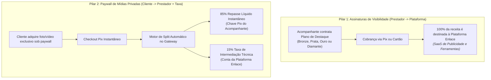
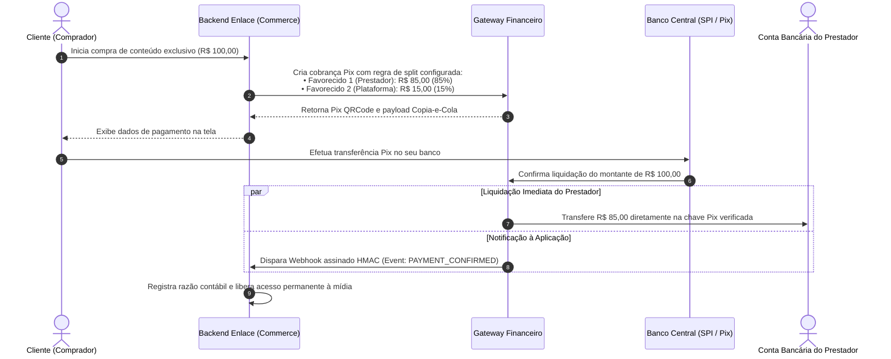

# 01.16 — FLUXOS FINANCEIROS, MONETIZAÇÃO HÍBRIDA E SPLIT AUTOMÁTICO

> **Documento:** 01.16  
> **Fase:** Modelagem e Arquitetura (Modelo em Cascata)  
> **Classificação:** Engenharia Financeira / Split de Pagamentos  
> **Versão:** 1.0.0  
> **Status:** Aprovado  

---

## 1. Arquitetura dos Dois Pilares de Monetização

O modelo de negócio do Enlace sustenta-se em duas fontes de receita complementares, operadas através de um motor de split integrado:

---

## 2. Diagrama de Sequência: Split Instantâneo via Webhook Pix

---

## 3. Diretrizes de Governança Financeira

1. **Validação Rígida Anti-Fraude no Split:**
   - O repasse financeiro só é executado para chaves Pix cuja titularidade de CPF corresponda exatamente ao documento aprovado no KYC civil.
2. **Idempotência Estrita de Webhooks:**
   - Toda notificação do gateway é processada mediante registro de chave de idempotência (`idempotency_key = webhook_event_id`), impedindo créditos duplicados em caso de retentativas de rede.
3. **Isolamento de Custódia:**
   - O dinheiro transacionado nas mídias privadas não fica retido desnecessariamente no caixa da plataforma, sendo liquidado instantaneamente na conta do prestador via split do gateway, o que mitiga passivos regulatórios e operacionais.
