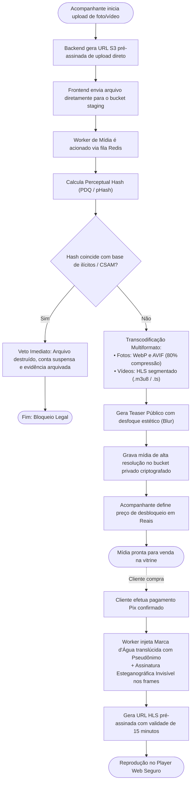

# 01.17 — CICLO DE VIDA DE CONTEÚDO E MÍDIA PRIVADA

> **Documento:** 01.17  
> **Fase:** Modelagem e Arquitetura (Modelo em Cascata)  
> **Classificação:** Engenharia de Mídia / Segurança Audiovisual  
> **Versão:** 1.0.0  
> **Status:** Aprovado  

---

## 1. Pipeline de Ingestão, Proteção e Distribuição de Mídia

O diagrama a seguir descreve as etapas de validação algorítmica, transcodificação e blindagem esteganográfica contra vazamentos:

---

## 2. Tecnologias de Proteção no Reprodutor Frontend

1. **Segmentação HLS Adaptativa:**
   - O vídeo nunca é entregue como um arquivo `.mp4` único e baixável. Ele é fatiado em microsegmentos de 4 segundos (`.ts`) carregados sob demanda via JavaScript, dificultando o salvamento direto por usuários leigos.
2. **Desativação de Menus e Comandos de Download:**
   - A interface desativa o menu de contexto de clique direito, atalhos de salvar página e suprime botões de download nativos nos navegadores (`controlsList="nodownload"`).
3. **Rastreabilidade Forense Esteganográfica:**
   - Caso um usuário utilize gravadores de tela ou ferramentas externas de captura, a marca d'água visível e a assinatura invisível embutida garantem a identificação inequívoca da conta compradora, permitindo ação jurídica imediata.
