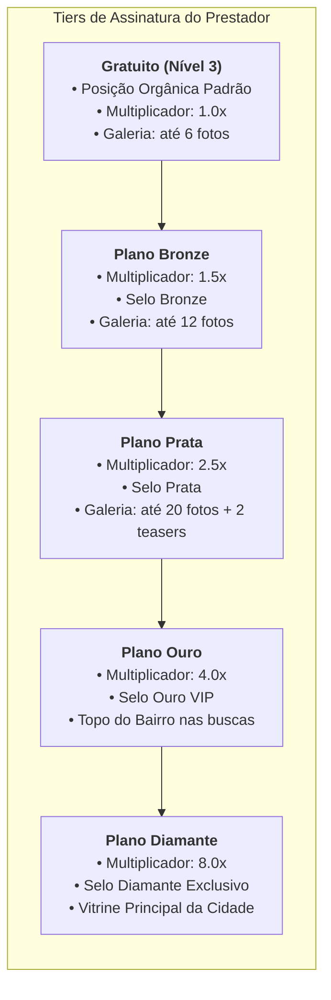
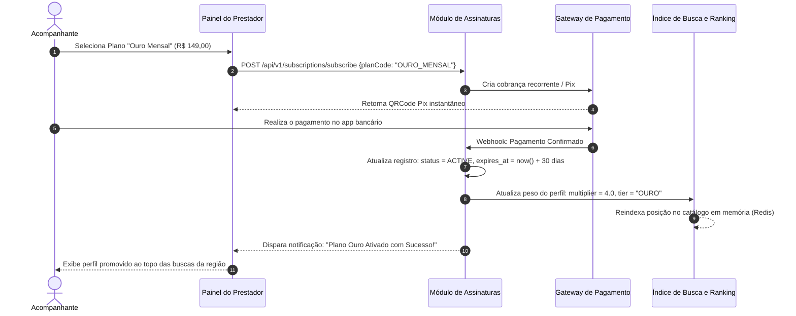

# 01.18 — FLUXO DE ASSINATURAS, PLANOS E DESTAQUE NO RANKING

> **Documento:** 01.18  
> **Fase:** Modelagem e Arquitetura (Modelo em Cascata)  
> **Classificação:** Engenharia de Produto / Algoritmo de Ranking  
> **Versão:** 1.0.0  
> **Status:** Aprovado  

---

## 1. Estrutura de Níveis e Multiplicadores de Destaque

O algoritmo de posicionamento no catálogo do Enlace combina a localização aproximada com a modalidade de assinatura contratada pelo acompanhante:

---

## 2. Diagrama de Sequência da Ativação de Destaque

---

## 3. Algoritmo de Pontuação de Ranking (Score Final)

A fórmula de ordenação determinística das listagens é calculada segundo a seguinte equação:

$$\text{RankingScore} = (\text{BaseScore} \times \text{TierMultiplier}) + (\text{AccessibilityMatch} \times 50) + (\text{ReviewScore} \times 10) - (\text{DistanceKm} \times 2)$$

- **Onde:**
  - $\text{TierMultiplier} \in \{1.0, 1.5, 2.5, 4.0, 8.0\}$;
  - $\text{AccessibilityMatch} \in [0, 1]$ (adiciona até 50 pontos extras quando o perfil atende perfeitamente aos requisitos funcionais do cliente);
  - $\text{ReviewScore} \in [1, 5]$ (média ponderada de avaliações públicas);
  - $\text{DistanceKm}$ penaliza proporcionalmente a distância do centro da busca sem quebrar a privacidade.
