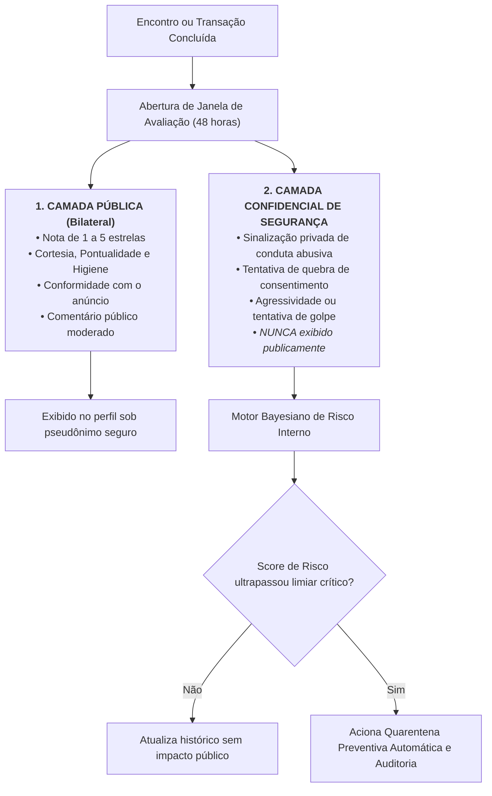
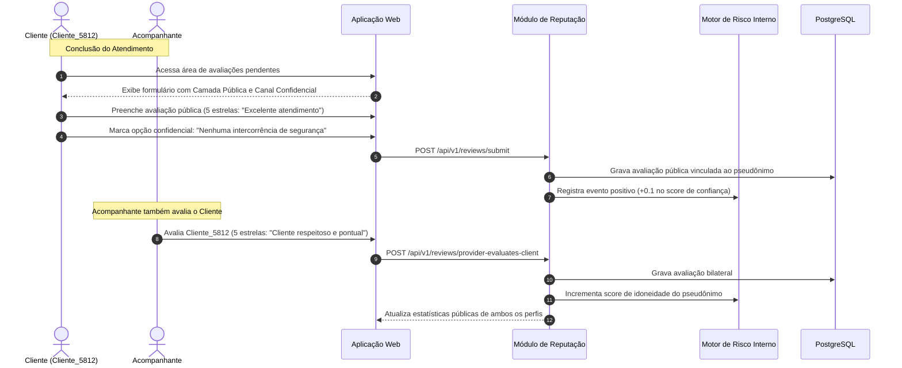

# 01.19 — AVALIAÇÃO BILATERAL E SCORING CONFIDENCIAL DE SEGURANÇA

> **Documento:** 01.19  
> **Fase:** Modelagem e Arquitetura (Modelo em Cascata)  
> **Classificação:** Engenharia de Confiança / Algoritmos de Reputação  
> **Versão:** 1.0.0  
> **Status:** Aprovado  

---

## 1. As Duas Camadas de Feedback Comunitário

Para conciliar transparência de serviço com prevenção a linchamentos virtuais e extorsões, o Enlace implementa uma **arquitetura de avaliação em duas camadas segregadas**:

---

## 2. Diagrama de Sequência da Avaliação Bilateral

---

## 3. Blindagem contra Avaliações Vingativas (*Revenge Reviews*)

1. **Requisito de Prova de Interação:**
   - Nenhum usuário pode avaliar outro sem que haja registro prévio de emissão de cartão de solicitação ou transação financeira comprovada no banco de dados.
2. **Avaliação Cega Temporária (Double-Blind Window):**
   - A avaliação do cliente só se torna pública após o prestador também submeter a sua, ou após o decurso irrevogável de 7 dias, impedindo retaliações reativas imediatas.
3. **Imunidade do Canal Confidencial:**
   - Como os relatos de quebra de consentimento ou agressão operam exclusivamente como insumo estatístico no motor de risco, não há como o agressor saber quem submeteu o sinalizador, protegendo a integridade da vítima.
