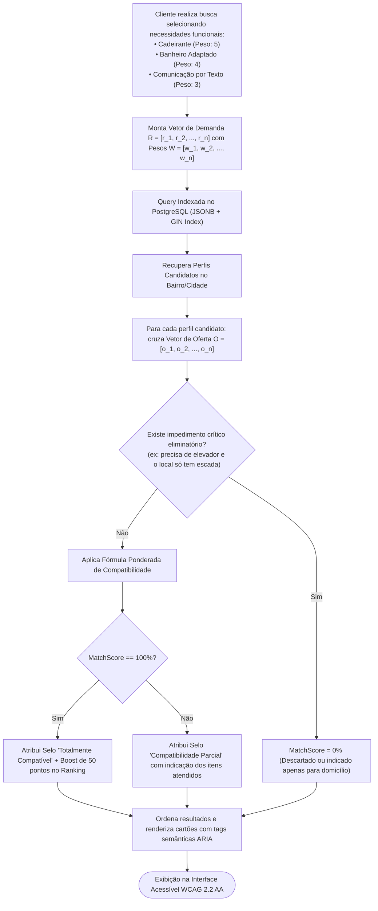

# 01.20 — MOTOR DE COMPATIBILIDADE E ACESSIBILIDADE ESTRUTURAL

> **Documento:** 01.20  
> **Fase:** Modelagem e Arquitetura (Modelo em Cascata)  
> **Classificação:** Engenharia de Domínio / Algoritmos de Matchmaking  
> **Versão:** 1.0.0  
> **Status:** Aprovado  

---

## 1. Fluxo de Execução do Motor de Compatibilidade

O diagrama a seguir detalha o processamento vetorial de requisitos funcionais no momento em que uma busca com filtros de acessibilidade é disparada:



---

## 2. Formalização Matemática do Match Score de Acessibilidade

O cálculo da afinidade funcional entre a necessidade do cliente e a oferta do prestador é definido formalmente por:

$$\text{MatchScore}(\vec{R}, \vec{O}) = \left( \frac{\sum_{i=1}^{m} w_i \cdot (r_i \land o_i)}{\sum_{i=1}^{m} w_i \cdot r_i} \right) \times 100\%$$

- **Onde:**
  - $\vec{R} = \{r_1, r_2, \dots, r_m\}$ representa o conjunto booleano de requisitos funcionais demandados pelo cliente ($r_i \in \{0, 1\}$);
  - $\vec{O} = \{o_1, o_2, \dots, o_m\}$ representa o conjunto booleano de comodidades e capacidades atestadas pelo prestador ($o_i \in \{0, 1\}$);
  - $w_i \in [1, 5]$ é o peso de criticidade de cada requisito atribuído pelo cliente ou pelo perfil de acessibilidade padrão da deficiência;
  - $\land$ denota o operador lógico de conjunção binária (ambos verdadeiros).

### Condição de Veto Físico Estrito (Veto Incompatível)
Se qualquer requisito categorizado como **impeditivo absoluto de locomoção** (ex: `MOB_RAMP_ELEVATOR`) tiver $r_{\text{rampa}} = 1$ e o local do atendimento tiver $o_{\text{rampa}} = 0$, a modalidade de atendimento em local próprio do prestador é desabilitada para o agendamento, sugerindo automaticamente o atendimento em domicílio adaptado do cliente (`MOB_HOME_VISIT`).

---

## 3. Estrutura de Indexação no Banco de Dados (PostgreSQL DDL)

Para sustentar tempos de resposta $P_{95} \le 80\text{ ms}$ (conforme o requisito **RNF-001**), a modelagem utiliza índices invertidos GIN sobre documentos estruturados JSONB:

```sql
-- Índice GIN para busca instantânea de tags de acessibilidade
CREATE INDEX idx_provider_accessibility_gin 
ON accessibility_offerings USING gin (feature_code);

-- Consulta de interseção de compatibilidade funcional
SELECT p.id, p.artistic_name, p.neighborhood,
       ARRAY_AGG(a.feature_code) AS matched_features
FROM provider_profiles p
JOIN accessibility_offerings a ON a.provider_id = p.id
WHERE p.status = 'ACTIVE'
  AND p.city = 'Rio Branco'
  AND a.feature_code = ANY(ARRAY['COMM_LIBRAS', 'MOB_RAMP_ELEVATOR', 'COMM_TEXT_ONLY'])
GROUP BY p.id, p.artistic_name, p.neighborhood;
```
