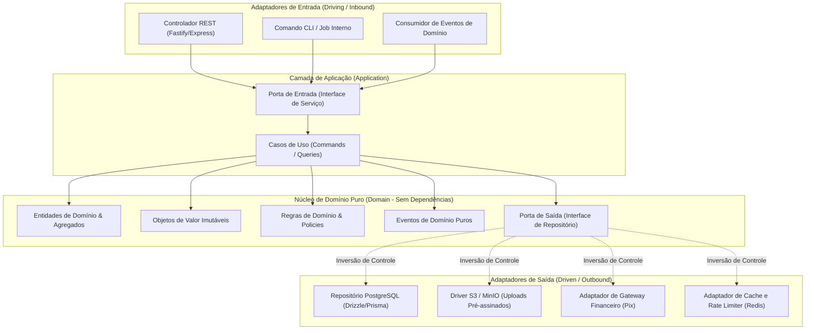

# 01.21 — ARQUITETURA HEXAGONAL DOS MÓDULOS DE DOMÍNIO

> **Documento:** 01.21  
> **Fase:** Modelagem e Arquitetura (Modelo em Cascata)  
> **Classificação:** Arquitetura de Software / Clean Architecture  
> **Versão:** 2.0.0  
> **Status:** Aprovado  

---

## 1. Estrutura Canônica de um Bounded Context

O diagrama a seguir detalha a implementação do padrão **Ports & Adapters (Arquitetura Hexagonal)** aplicado a cada um dos 13 módulos do **Enlace Backend Core**:

---

## 2. Inversão de Controle e Testabilidade

1. **Testes Unitários Puros e Instantâneos:**
   - A camada `Domain` e `Application` é testada sem subir nenhum banco de dados ou container. Repositórios e gateways externos são substituídos por fakes em memória em questão de milissegundos.
2. **Independência de Framework:**
   - A migração futura de um framework HTTP (ex: de Express para Fastify ou Hono) impacta unicamente a pasta `Presentation`, deixando o core de negócio $100\%$ intocado.
