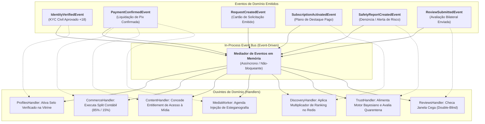

# 01.22 — BARRAMENTO DE EVENTOS DE DOMÍNIO (DOMAIN EVENTS)

> **Documento:** 01.22  
> **Fase:** Modelagem e Arquitetura (Modelo em Cascata)  
> **Classificação:** Arquitetura de Software / Event-Driven Architecture  
> **Versão:** 2.0.0  
> **Status:** Aprovado  

---

## 1. Coreografia de Eventos Internos do Monólito

O diagrama a seguir rastreia os principais eventos de domínio disparados pelas ações centrais da plataforma e seus respectivos ouvintes (*Handlers*):

---

## 2. Padrão Outbox para Consistência Transacional

Para garantir que nenhum evento seja perdido em caso de reinicialização ou falha de infraestrutura durante uma transação financeira crítica, o sistema implementa o **Transactional Outbox Pattern**:

1. A gravação da ordem paga e a emissão do `PaymentConfirmedEvent` ocorrem dentro da **mesma transação SQL** no PostgreSQL;
2. O evento é persistido na tabela `outbox_events`;
3. Um leitor assíncrono consome a tabela e entrega o evento aos handlers, garantindo entrega do tipo *at-least-once*.
