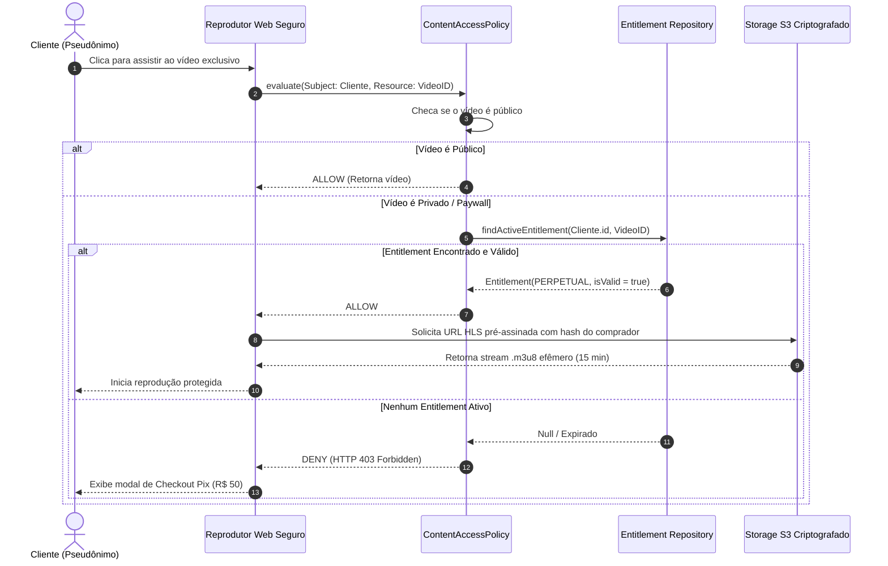

# 01.23 — MODELO DE ENTITLEMENTS E ACESSO A CONTEÚDO PAGO

> **Documento:** 01.23  
> **Fase:** Modelagem e Arquitetura (Modelo em Cascata)  
> **Classificação:** Engenharia de Domínio / Monetização Digital  
> **Versão:** 2.0.0  
> **Status:** Aprovado  

---

## 1. Desacoplamento entre Conteúdo e Direito de Acesso

O **Enlace** não trata conteúdo pago como uma mera flag booleana `is_premium = true`. Em vez disso, implementa um **Domínio Dedicado de Entitlements**, permitindo compras avulsas, pacotes e assinaturas recorrentes sem reestruturação de banco no futuro:

```mermaid
classDiagram
    %% Entidade de Conteúdo
    class ContentAsset {
        +UUID id
        +UUID providerId
        +AccessTier tier
        +Money priceCents
        +String hlsPlaylistUrl
        +String perceptualHash
        +bool isAvailable()
    }

    <<enumeration>> AccessTier
    class AccessTier {
        PUBLIC
        PAID_SINGLE
        SUBSCRIBER_ONLY
        BUNDLE_ONLY
    }

    %% Entidade de Direito de Acesso
    class Entitlement {
        +UUID id
        +UUID accountId
        +UUID contentAssetId
        +EntitlementType type
        +DateTime grantedAt
        +DateTime expiresAt
        +bool isRevoked
        +isValidNow() bool
    }

    <<enumeration>> EntitlementType
    class EntitlementType {
        PERPETUAL_SINGLE_ITEM
        RECURRING_SUBSCRIPTION
        BUNDLE_GRANT
        PROMOTIONAL_PASS
    }

    ContentAsset "1" <-- "*" Entitlement : autoriza consumo
```

---

## 2. Diagrama de Sequência da Validação de Acesso (ContentAccessPolicy)


