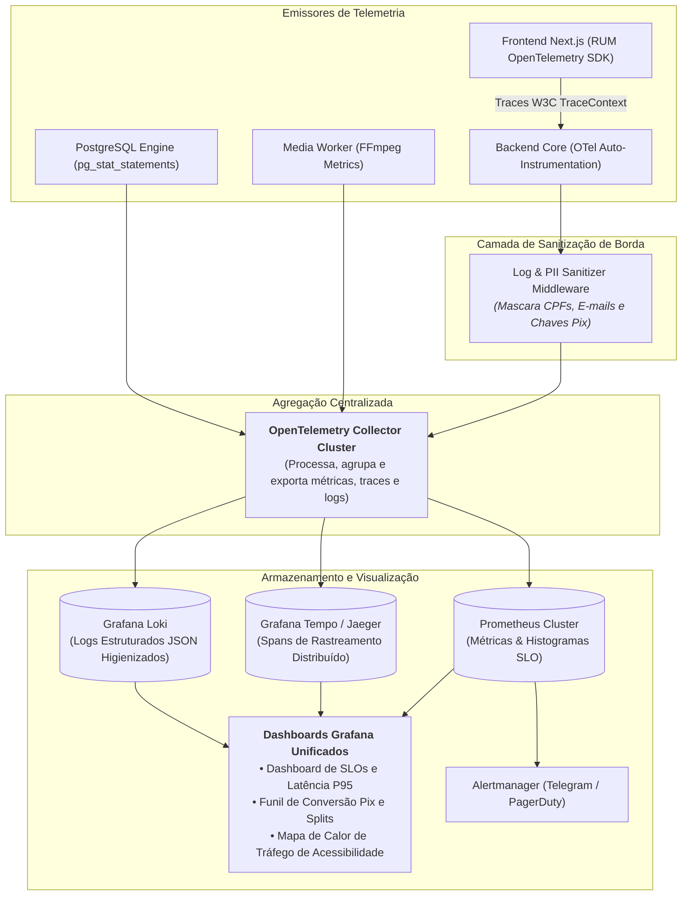

# 01.24 — PIPELINE DE OBSERVABILIDADE E RASTREAMENTO DISTRIBUÍDO

> **Documento:** 01.24  
> **Fase:** Modelagem e Arquitetura (Modelo em Cascata)  
> **Classificação:** Engenharia de Confiabilidade / SRE & APM  
> **Versão:** 2.0.0  
> **Status:** Aprovado  

---

## 1. Topologia da Telemetria Unificada (OpenTelemetry)

O diagrama a seguir descreve a coleta, higienização de dados pessoais e agregação de métricas, traces e logs em tempo real:

---

## 2. Propagação de Contexto W3C TraceContext

Para rastrear qualquer lentidão ou anomalia operacional ponta a ponta:
1. O navegador injeta o cabeçalho padronizado `traceparent: 00-4bf92f3577b34da6a3ce929d0e0e4736-00f067aa0ba902b7-01`;
2. O API Gateway propaga o identificador para o Monólito Modular;
3. As queries ao PostgreSQL recebem o ID como comentário SQL (`/* trace_id=... */`);
4. Em caso de falha no checkout Pix, os operadores localizam a requisição em segundos sem inspecionar dados íntimos do cliente.
