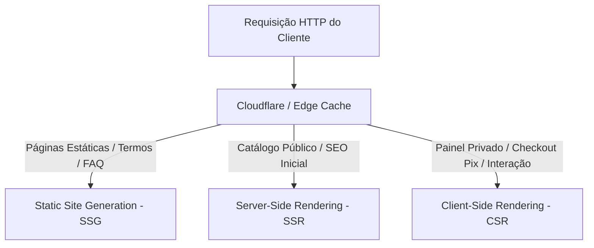

# 05.01 — ARQUITETURA DE FRONTEND, RENDERING E STATE MANAGEMENT

> **Documento:** 05.01  
> **Fase:** Projeto e Engenharia de Frontend (Modelo em Cascata)  
> **Classificação:** Engenharia de Software / Arquitetura de Apresentação  
> **Versão:** 1.0.0  
> **Status:** Aprovado  

---

## 1. Visão Geral da Arquitetura de Apresentação

O Frontend da **Plataforma Enlace** é projetado como uma **Single Page Application (SPA) / Progressive Web App (PWA)** com suporte a Server-Side Rendering (SSR) e Static Site Generation (SSG) via Next.js 14+ (App Router). 

A arquitetura prioriza:
1. **Desempenho Extremo (Core Web Vitals):** LCP $\le 1.2\,\text{s}$, FID $\le 50\,\text{ms}$, CLS $\le 0.05$.
2. **Privacidade Compulsória do Cliente:** Zero armazenamento de dados sensíveis civis em `localStorage` ou `sessionStorage`.
3. **Acessibilidade Universal (WCAG 2.1 AA):** Suporte nativo a navegação por teclado, contraste ajustável e leitores de tela.

---

## 2. Estratégia de Rendering Híbrido



### 2.1. Segmentação por Rota

* **`/` (Vitrine de Busca):** SSR com revalidação estocástica (ISR - 60s) para garantir indexação rápida sem vazar geolocalização exata.
* **`/perfil/:id` (Perfil do Acompanhante):** SSR com dados de catálogo abertos (nome artístico, fotos públicas, comodidades de acessibilidade).
* **`/solicitacao` e `/checkout`:** CSR estrito protegido por autenticação JWT em memória, garantindo que credenciais transitórias nunca fiquem gravadas no disco do navegador.

---

## 3. Gerenciamento de Estado (State Management)

Para evitar re-renderizações desnecessárias e manter a independência entre módulos do frontend, adota-se uma separação estrita de escopos de estado:

| Escopo | Tecnologia | Propósito | Política de Persistência |
| :--- | :--- | :--- | :--- |
| **Server State (API)** | TanStack Query (React Query) | Cache de busca, perfis, status de ordens | Cache em memória (`staleTime: 30s`) |
| **Client UI State** | Zustand / Context API | Tema (Luminoso / Noturno / Alto Contraste), Escala de Fonte | `localStorage` (Apenas preferências visuais) |
| **Auth & Session State** | Memory State + HttpOnly Cookies | Token JWT de sessão | **NUNCA** em `localStorage` (Proteção anti-XSS) |

---

## 4. Política Anti-Vazamento no Navegador (Client-Side Privacy)

1. **Prevenção de Cache Sensível (`Cache-Control`):**
   * Respostas autenticadas possuem cabeçalho:
     ```http
     Cache-Control: no-store, no-cache, must-revalidate, proxy-revalidate
     Pragma: no-cache
     Expires: 0
     ```
2. **Sanitização de Histórico:**
   * URLs de checkout Pix não expõem chaves ou dados pessoais na query string (`/checkout` consome payload via POST/body criptografado).
3. **Limpeza de Memória:**
   * Ao efetuar logout ou fechar a aba, os stores de estado em memória são destruídos imediatamente via `store.reset()`.
