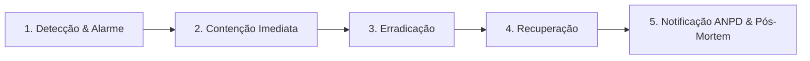

# 07.02 — PLANO DE RESPOSTA A INCIDENTES E NOTIFICAÇÃO ANPD (LGPD ART. 48)

> **Documento:** 07.02  
> **Fase:** Conformidade Legal e Operações de Segurança (Modelo em Cascata)  
> **Classificação:** Gestão de Risco / Compliance Regulatório  
> **Versão:** 1.0.0  
> **Status:** Aprovado  

---

## 1. Classificação de Severidade de Incidentes

| Nível de Severidade | Definição | Prazo Máximo de Contenção |
| :--- | :--- | :--- |
| **SEV-1 (Crítico)** | Exfiltração confirmada do cofre civil (`vault_civil`) ou credenciais mestras | 1 hora |
| **SEV-2 (Alto)** | Tentativa coordenada de scraping massivo ou desanonimização de clientes | 4 horas |
| **SEV-3 (Médio)** | Falha no pipeline de marca d'água ou timeout em validação de maioridade | 12 horas |
| **SEV-4 (Baixo)** | Indisponibilidade momentânea de métricas ou dashboards internos | 24 horas |

---

## 2. Protocolo de Resposta em 5 Fases

### Fase 1: Contenção Imediata (SEV-1)
* Revogação instantânea de credenciais de serviço e rotação de segredos no Vault/KMS;
* Congelamento temporário das conexões de banco de dados do cofre civil;
* Acionamento da Equipe de Gestão de Crise (DPO, Líder de Engenharia, Assessor Jurídico).

### Fase 2: Perícia Forense e Rastreabilidade
* Inspeção das marcas d'água forenses (esteganografia) em mídias vazadas para identificar a conta de origem;
* Análise dos logs de auditoria imutáveis com WORM lock no Amazon S3 / Cloudflare R2;
* Determinação precisa do escopo de titulares impactados.

---

## 3. Notificação Obrigatória à ANPD (Art. 48 da LGPD)

Em conformidade com a Resolução CD/ANPD nº 15/2024:
1. **Prazo de Notificação:** Envio de comunicação formal à Autoridade Nacional de Proteção de Dados (ANPD) em até **3 dias úteis** após a confirmação do incidente relevante.
2. **Conteúdo Obrigatório da Notificação:**
   * Descrição da natureza dos dados pessoais afetados;
   * Medidas técnicas e de segurança que foram aplicadas para mitigar o dano;
   * Riscos identificados para os titulares e medidas de proteção sugeridas aos mesmos;
   * Contato oficial do Encarregado de Proteção de Dados (DPO).
