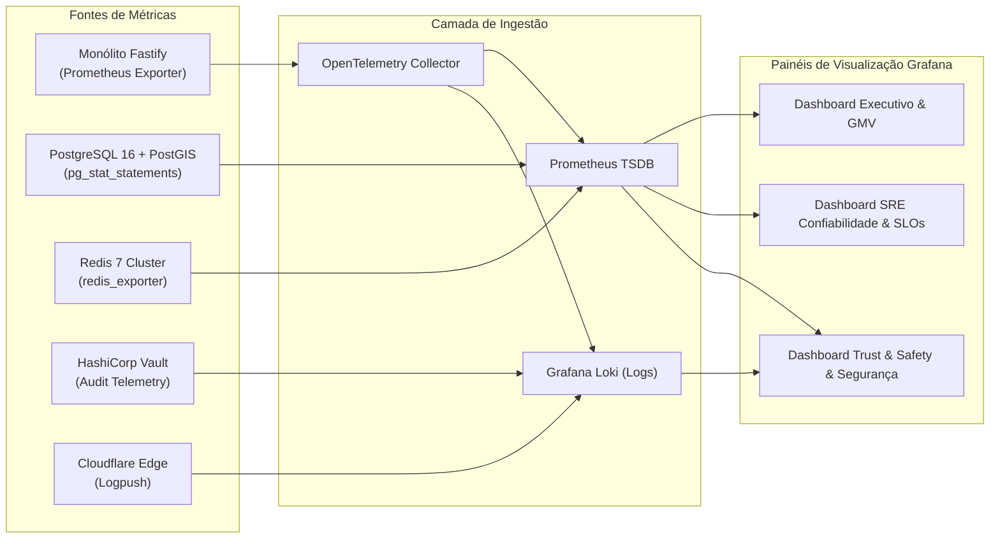

# 12.03 — DASHBOARD EXECUTIVO E MÉTRICAS DE CONFIABILIDADE (SRE & BI)

> **Documento:** 12.03  
> **Fase:** Observabilidade e Gestão de Confiabilidade (Cascata / Operação)  
> **Classificação:** Engenharia SRE / Business Intelligence & Telemetria  
> **Versão:** 1.0.0  
> **Status:** Aprovado  

---

## 1. Visão Geral e Arquitetura de Dashboards

A observabilidade na **Plataforma Enlace** atende a dois pilares fundamentais:
1. **Confiabilidade de Engenharia (SRE / Platform):** Rastreamento de SLIs/SLOs, orçamentos de erro (*Error Budgets*), latências P95/P99 de busca PostGIS, taxa de erro HTTP 5xx e integridade das filas de workers Redis.
2. **Saúde de Negócio e Trust & Safety (Executivo / BI):** Volume transacional Pix, índice de conversão de contatos seguros, métricas de adoção de filtros de acessibilidade e monitoramento em tempo real de denúncias e acionamentos do Cofre Civil.



---

## 2. Matriz de SLIs, SLOs e Error Budgets

Os acordos de nível de serviço internos (SLOs) são calculados em uma janela móvel de **30 dias consecutivos**:

| Categoria | Indicador de Nível de Serviço (SLI) | Meta (SLO) | Error Budget (30 dias) | Ação em caso de Esgotamento |
| :--- | :--- | :---: | :---: | :--- |
| **Disponibilidade Global** | $\frac{\text{Requisições HTTP bem-sucedidas (status } < 500\text{)}}{\text{Total de requisições HTTP válidas}}$ | **$99,95\%$** | $21,6\text{ minutos de downtime}$ | Congelamento de deploys de features; foco 100% em resiliência. |
| **Latência de Busca** | $\text{Latência } P_{95} \text{ do endpoint } \texttt{GET /profiles/search}$ com PostGIS | **$\le 80\text{ ms}$** | $5\%$ das buscas podem exceder $80\text{ms}$ | Otimização de índices GiST e warming de cache Redis. |
| **Liquidação Pix** | $\frac{\text{Splits Pix liquidados com sucesso em } \le 3\text{s}}{\text{Total de ordens com split Pix emitidas}}$ | **$99,99\%$** | $0,01\%$ ($1$ em $10.000$ transações) | Page imediato da equipe de Pagamentos (SEV-1). |
| **Acessibilidade Digital** | $\frac{\text{Páginas com Conformidade WCAG 2.1 AA (Axe-Core)}}{\text{Total de rotas ativas do Frontend}}$ | **$100\%$** | $0\%$ de tolerância para violações críticas | Bloqueio de PR no pipeline CI/CD. |

---

## 3. Especificação dos Painéis do Grafana

### Painel 1: Dashboard Executivo (Business Intelligence)
* **Objetivo:** Fornecer à liderança visibilidade instantânea do volume financeiro, engajamento e impacto de inclusão.
* **Métricas Principais:**
  - **GMV Horário & Diário:** `sum(rate(enlace_order_amount_brl_cents_total[1h])) / 100`
  - **Taxa de Conversão de Contato Seguro:** $\frac{\text{Cliques em 'Iniciar Contato Mascarado'}}{\text{Visualizações Únicas de Perfil}}$
  - **Distribuição de Acessibilidade:** Gráfico de pizza discriminando perfis por filtros inclusivos (Atendimento PcD, Braille, Libras, Ambientes Térreos).
  - **Volume de Repasse Instantâneo Pix (Split):** `sum(rate(enlace_pix_split_settled_cents_total[1h])) / 100`

### Painel 2: Dashboard SRE & Confiabilidade de Infraestrutura
* **Objetivo:** Diagnóstico em tempo real para equipe de plataforma e resposta a incidentes.
* **Componentes:**
  - **Burn Rate de Error Budget (Janelas de 1h e 6h):**
    ```promql
    (
      sum(rate(enlace_http_requests_total{status=~"5.."}[1h]))
      /
      sum(rate(enlace_http_requests_total[1h]))
    ) / (1 - 0.9995)
    ```
    *Gera alerta SEV-1 se o consumo de erro for $14\times$ maior que a taxa permitida em 1h.*
  - **Heatmap de Latência de Busca Geográfica:** Percentis P50, P90, P95 e P99 para consultas espaciais PostGIS via ST_DWithin.
  - **Conexões do Pool PostgreSQL (PgBouncer/Prisma/Driver Nativo):** Saturação percentual do limite de $500$ conexões.
  - **Hit Ratio de Cache Redis:** `rate(enlace_cache_hits_total[5m]) / (rate(enlace_cache_hits_total[5m]) + rate(enlace_cache_misses_total[5m]))` (Meta: $\ge 92\%$).

### Painel 3: Dashboard de Segurança, Trust & Safety e Auditoria Civil
* **Objetivo:** Monitoramento de ameaças, ataques de scraping e conformidade de acesso a dados civis.
* **Indicadores:**
  - **Taxa de Bloqueio Anti-Scraping Cloudflare/WAF:** Volume de desafios Turnstile disparados e requisições bloqueadas por IP/ASN suspeito.
  - **Requisições de Abertura do Cofre Civil (Vault):** Contador de operações de decriptação de CPF/RG com discriminação de justificativa judicial.
  - **Fila de Moderação e Denúncias de Perfis:** Tempo médio de resposta a denúncias de coerção ou perfil falso (Meta: $\le 15\text{ minutos}$).
  - **Integridade de Esteganografia:** Percentual de mídias privadas processadas com marca d'água forense invisível com sucesso ($100\%$).

---

## 4. Configuração de Alertas de Queima de Error Budget (Multi-Window Multi-Burn-Rate)

```yaml
# Regra Grafana Alerting / Prometheus para queima acelerada de orçamento
- alert: FastErrorBudgetBurnRate
  expr: |
    (
      sum(rate(enlace_http_requests_total{status=~"5.."}[1h]))
      /
      sum(rate(enlace_http_requests_total[1h]))
    ) > (14 * 0.0005)
    and
    (
      sum(rate(enlace_http_requests_total{status=~"5.."}[5m]))
      /
      sum(rate(enlace_http_requests_total[5m]))
    ) > (14 * 0.0005)
  for: 2m
  labels:
    severity: page
    team: sre-core
  annotations:
    summary: "Consumo de mais de 5% do Error Budget em 1 hora"
    description: "A taxa de erro está 14x acima da tolerância mensal. Risco iminente de quebra de SLO de disponibilidade."
```
