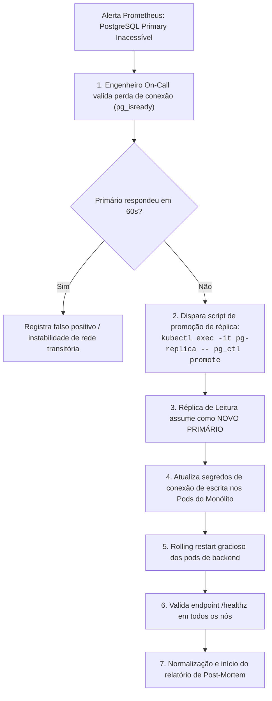

# 13.01 — RUNBOOK OPERACIONAL DE INCIDENTES E CONTINGÊNCIA (SRE PLAYBOOK)

> **Documento:** 13.01  
> **Fase:** Operação e Sustentação (Modelo em Cascata)  
> **Classificação:** Engenharia de Confiabilidade / Runbook Operacional  
> **Versão:** 1.0.0  
> **Status:** Aprovado  

---

## 1. Classificação de Severidade de Incidentes

| Severidade | Critério Técnico Operacional | SLA de Resposta | Notificação |
| :--- | :--- | :---: | :--- |
| **SEV-1 (Crítica)** | Indisponibilidade total da plataforma, falha generalizada no checkout Pix ou vazamento potencial de dados. | $\le 15\text{ minutos}$ | PagerDuty On-Call + SMS + Sala de Crise |
| **SEV-2 (Alta)** | Degradação de latência ($P_{95} > 150\text{ms}$), falha em workers de mídia ou lentidão na busca. | $\le 30\text{ minutos}$ | Notificação Slack/Telegram On-Call |
| **SEV-3 (Média)** | Falha pontual em relatórios analíticos ou instabilidade em provedores secundários não-bloqueantes. | $\le 4\text{ horas}$ | Canal Operacional Jira / Slack |

---

## 2. Playbook para SEV-1: Falha no Cluster de Banco de Dados (Failover Primário)



---

## 3. Playbook para Reversão Imediata de Release (Blue-Green Rollback)

Se uma nova versão em produção apresentar anomalias graves nos primeiros minutos após a virada de tráfego:

1. **Ação Imediata (Load Balancer / Cloudflare):**
   ```bash
   # Reverte 100% do tráfego para a versão Blue anterior
   kubectl patch service enlace-router -p '{"spec":{"selector":{"version":"blue"}}}'
   ```
2. **Validação de DDL:**
   - Como todas as migrações de banco seguem a regra *Expand and Contract*, a versão antiga permanece $100\%$ compatível com o banco sem necessidade de rollback destrutivo de tabelas.
3. **Comunicação:**
   - Registro de causa raiz no canal `#engineering-incidents` e abertura de issue post-mortem.
