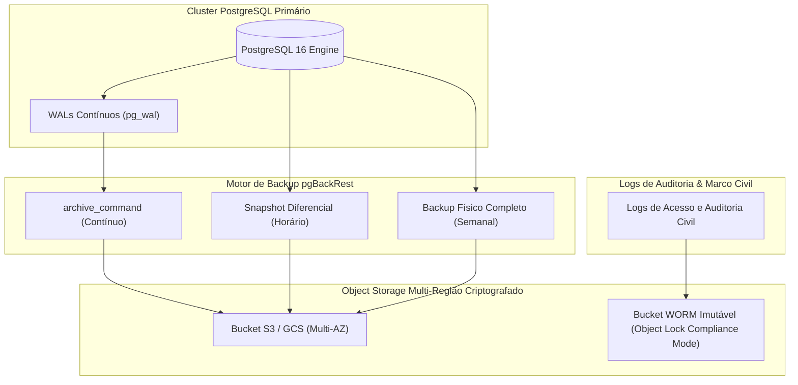

# 13.02 — POLÍTICA DE BACKUP, RETENÇÃO WORM E PROCEDIMENTOS DE RESTORE

> **Documento:** 13.02  
> **Fase:** Operação, Continuidade de Negócio e Compliance (Cascata / Operação)  
> **Classificação:** Engenharia SRE / Resiliência & Governança de Dados  
> **Versão:** 1.0.0  
> **Status:** Aprovado  

---

## 1. Objetivos de Continuidade de Negócio (RPO e RTO)

Em estrita consonância com os Requisitos Não-Funcionais (**NFR-RES-001** e **NFR-RES-002**) e o documento de resiliência (**00.23**), a plataforma opera sob os seguintes limites máximos aceitáveis de desastre:

| Métrica de Resiliência | Definição Operacional | Alvo Contratual | Estratégia de Atendimento |
| :--- | :--- | :---: | :--- |
| **RPO (Recovery Point Objective)** | Perda máxima tolerável de dados transacionais em caso de falha catastrófica. | **$\le 1\text{ hora}$** | Arquivamento contínuo de WALs (*Write-Ahead Logs*) no S3 + snapshots horários. |
| **RTO (Recovery Time Objective)** | Tempo máximo aceitável para restauração completa dos serviços e APIs. | **$\le 4\text{ horas}$** | Automação com pgBackRest, templates Terraform para re-instanciação de nós e réplicas prontas. |

---

## 2. Tipologia e Cronograma de Backups



### 2.1 Matriz de Frequência e Tipos de Cópia

1. **Arquivamento Contínuo de WALs (PITR):**
   - Transmitidos a cada encerramento de segmento ($16\text{MB}$) ou no máximo a cada $5\text{ minutos}$ via `archive_timeout = 300s`.
   - Permite restauração a qualquer ponto no tempo (*Point-in-Time Recovery*) nos últimos $30\text{ dias}$.
2. **Backup Diferencial (Incremental):**
   - Executado a cada $6\text{ horas}$ nos horários de menor tráfego ($04\text{h}$, $10\text{h}$, $16\text{h}$, $22\text{h}$).
3. **Backup Físico Completo (*Full Backup*):**
   - Executado semanalmente aos domingos às $02:00\text{ UTC}$ com verificação de checksum de blocos de disco.
4. **Dump Lógico Estrutural:**
   - `pg_dump` dos esquemas de banco (DDL sem dados de usuários) versionado no repositório a cada deploy.

---

## 3. Retenção WORM (*Write Once, Read Many*) e Conformidade Legal

A retenção imutável previne qualquer adulteração acidental ou criminosa (inclusive por administradores com credenciais comprometidas), atendendo ao **Marco Civil da Internet (Lei 12.965/14, Art. 15)** e à **LGPD**:

| Tipo de Dado | Destino de Armazenamento | Modo de Imutabilidade | Prazo de Retenção Obrigatória | Base Legal / Governança |
| :--- | :--- | :---: | :---: | :--- |
| **Logs de Conexão IP / Portas / Sessões** | Bucket WORM `enlace-compliance-logs` | *S3 Object Lock (Compliance Mode)* | **6 meses inalteráveis** | Marco Civil da Internet (Art. 15) |
| **Registros Fiscais e Liquidação Pix** | Bucket WORM `enlace-financial-ledger` | *S3 Object Lock (Compliance Mode)* | **5 anos inalteráveis** | Código Tributário Nacional & Bacen |
| **Trilhas de Auditoria do Cofre Civil** | Bucket WORM `enlace-vault-audit` | *S3 Object Lock (Compliance Mode)* | **5 anos inalteráveis** | Governança de Chaves e Acesso Judicial |
| **Snapshots de Banco de Produção** | Bucket Versionado com MFA Delete | Retenção padrão com deleção protegida | **30 dias (ciclo rotativo)** | Política Interna de Continuidade SRE |

> **Nota de Segurança:** O *Compliance Mode* do AWS S3 / Cloud Storage impede que mesmo a conta `root` da AWS exclua ou reduza o período de retenção de um objeto antes do vencimento do lock.

---

## 4. Procedimento Operacional de Restore e PITR (Runbook Passo a Passo)

### Cenário: Corrupção de Dados ou Ataque Ransomware — Restauração para Ponto Específico

```bash
# ============================================================================
# RUNBOOK DE PITR (POINT-IN-TIME RECOVERY) — POSTGRESQL 16 COM PGBACKREST
# ============================================================================

# 1. Parar o serviço do banco no nó de recuperação
systemctl stop postgresql@16-main

# 2. Limpar o diretório de dados danificado
rm -rf /var/lib/postgresql/16/main/*

# 3. Executar o restore até o instante exato anterior ao incidente (Ex: 2026-09-25 12:45:00 UTC)
pgbackrest --stanza=enlace-db \
  --type=time \
  --target="2026-09-25 12:45:00" \
  --target-action=promote \
  restore

# 4. Validar permissões do diretório de dados
chown -R postgres:postgres /var/lib/postgresql/16/main
chmod 700 /var/lib/postgresql/16/main

# 5. Iniciar o PostgreSQL no modo de recuperação
systemctl start postgresql@16-main

# 6. Monitorar o avanço dos WALs no log do banco
tail -f /var/log/postgresql/postgresql-16-main.log | grep -E "restored log file|recovery target"

# 7. Executar suite de verificação de sanidade
npm run db:verify-integrity
```

---

## 5. Simulados Periódicos de Desastre (*Game Days*)

Para garantir que a equipe e a automação operem sem atrito em um desastre real:
1. **Frequência:** A cada $90\text{ dias}$ (trimestral).
2. **Ambiente de Teste:** O restore é executado em um ambiente de *Staging Isolado* a partir do backup mais recente de produção.
3. **Métricas de Validação:**
   - O tempo total de restauração deve ser medido e registrar obrigatoriamente $\le 4\text{ horas}$.
   - Os testes de integração automatizados (`npm test`) são disparados contra o banco restaurado para comprovar a higidez referencial de $100\%$ das tabelas e índices espaciais PostGIS.
4. **Relatório Formal:** Emissão de ata assinada pelo SRE Lead e pelo DPO/Security Officer.
